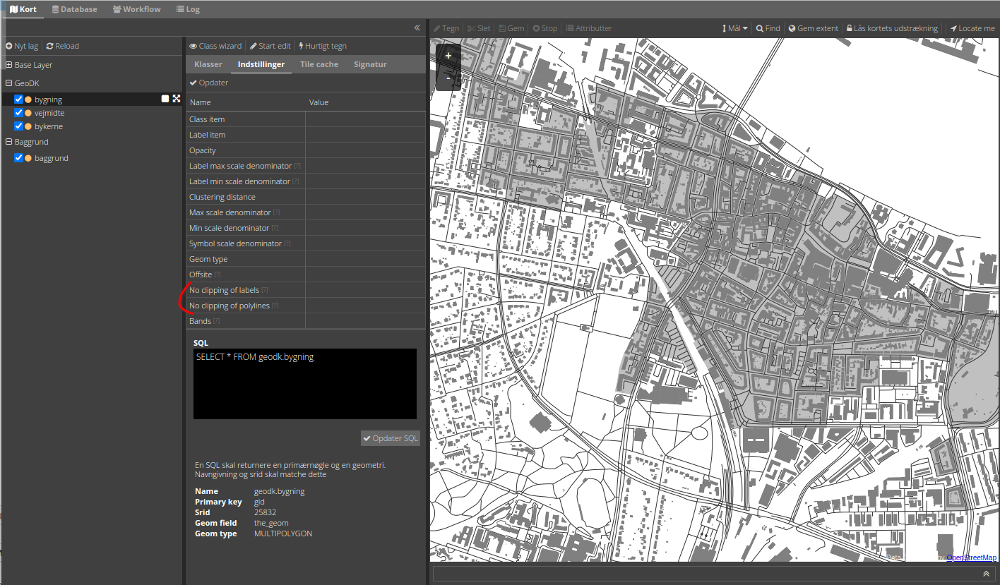
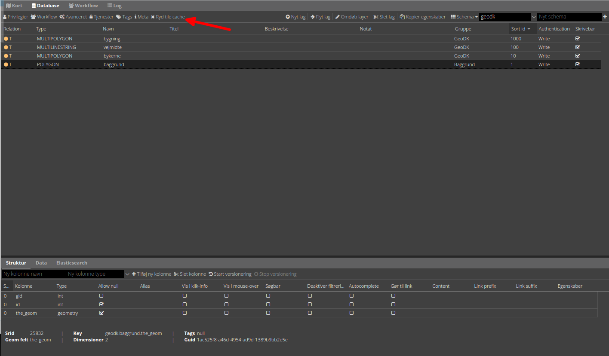

# Schema-opsætning

GC2 samler alle lag i et schema til ét sammensmeltet lag, som udstilles gennem MapCache API'et. Dette sker helt automatisk, så der er ingen opsætning bortset fra selve opsætning af de enkelte lags styling og sortering.

Bemærk:   

* Datasættet extent.shp skal ikke styles eller behøves opsætning af nogen art. Dette lag skal bruges til at afgrænse seeding af tiles. Dette lag placeres typisk i et andet schema.

* De enkelte lags opsætning i `Tile cache` fanen har ingen betydning for det sammensmeltet baggrundskort.

## Sorting i et baggrundskort

De enkelte lag i baggrundskortet sammenlægges i den rækkefølge, som `sort_id` angiver (højeste sort_id lægges øverest).

## Sletning af cache

Sletning af cachen for baggrundskortet sker ved klik på `Ryd tile cache` i Database-fanen.

## Nyttige instillinger (Gælder kun MapServer)

`No clipping of labels` og `No clipping of polylines` kan afhjælpe af flader får mere end én label og stiplede linjer kommer til at se forkerte ud henover tile-sømmene 

## Øvelse

- Upload de fem datasæt til GC2. HUSK `exent.shp` skal uploades som EPSG:3857

- Giv lagene en passende styling og sort_id. QGIS kan anvendes til styling. `baggrund.shp` er tænkt som et dækkende nederst lag, der giver en passende baggrundsfarve.

- I GC2 Kort-fanen, tænd alle lag. Det er sådan baggrundskortet kommer til at se ud.