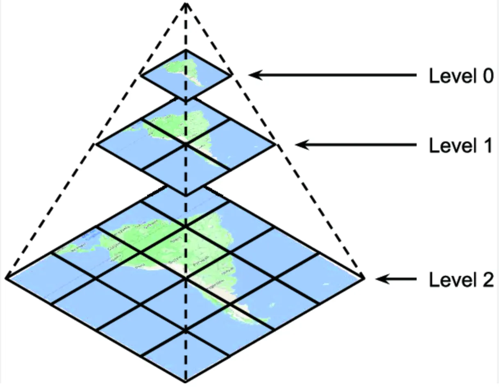

# Tile-systemer (grids)

Alle tiles (raster eller vektor) ligger i et tile-system, i MapCache kaldet et "grid". Grid'et bestemmer hvilken projektion tiles er i, og hvordan kortet deles op i zoom-niveauer og tiles. Klient og server skal være enige om grid'et, ellers passer tiles ikke sammen.   

Tiles skabt i et grid kan IKKE anvendes i et andet grid!

## Et grid består af

| Element | Betydning |
|---|---|
| `srs` | Projektionen, fx `EPSG:3857` eller `EPSG:25832` |
| `extent` | Det område grid'et dækker (minx miny maxx maxy). Nederste venstre hjørne er grid'ets "origo" |
| `size` | Tile-størrelsen i pixels, typisk `256 256` |
| `resolutions` | Kort-enheder (fx meter) pr. pixel for hvert zoom-niveau. Første værdi er zoom 0, næste zoom 1 osv. |
| `units` | Enheden for projektionen, typisk `m` |

Ud fra dette kan man regne alt andet ud.



## Standard-grid'et g20 (Google Maps / web mercator)

GC2 har altid grid'et `g20`, som er det velkendte "GoogleMapsCompatible" tile-system i `EPSG:3857`:

* Dækker hele verden i én tile på zoom 0
* Resolutionen halveres for hvert zoom-niveau (156543 m/px på zoom 0 → ca. 0,3 m/px på zoom 19)
* Tiles adresseres med `{z}/{x}/{y}` med origo øverst til venstre

Det er dette grid, som Vidi, Leaflet, MapLibre, Google Maps, OSM osv. bruger som standard.

## Et dansk UTM grid – EPSG:25832

Skal tiles bruges i en klient, der kører i UTM (fx QGIS, OpenLayers eller andre desktop-/web-systemer i `EPSG:25832`), kan man definere sit eget grid. Her er et eksempel fra GC2, som passer til officielle danske UTM-tiles (`app/conf/grids/25832.xml`):

```xml
<grid name="25832">
    <metadata>
        <title>Dansk UMT</title>
    </metadata>
    <extent>120000 5900000 1000000 6500000</extent>
    <srs>EPSG:25832</srs>
    <srsalias>EPSG:25832</srsalias>
    <units>m</units>
    <size>256 256</size>
    <resolutions>1638.4 819.2 409.6 204.8 102.4 51.2 25.6 12.8 6.4 3.2 1.6 0.8 0.4 0.2 0.1 0.05</resolutions>
</grid>
```
En tabel over zoom-niveauerne:

| Zoom | Resolution (m/px) | Tile-bredde (m) | Ca. målestok (0,28 mm/px) |
|---|---|---|---|
| 0 | 1638,4 | 419.430 | 1:5.851.000 |
| 4 | 102,4 | 26.214 | 1:366.000 |
| 8 | 6,4 | 1.638 | 1:22.900 |
| 10 | 1,6 | 410 | 1:5.700 |
| 12 | 0,4 | 102 | 1:1.430 |
| 15 | 0,05 | 12,8 | 1:180 |

Bemærk at zoom-niveauerne i et UTM-grid IKKE svarer til zoom-niveauerne i `g20`. Ved seeding skal start/slut-zoom derfor vælges ud fra det konkrete grid.

## Brug af et UTM grid

Tiles i et UTM-grid hentes via WMTS eller TMS med grid-navnet i stedet for `g20`:

```
# WMTS capabilities – kan tilføjes i QGIS under "WMS/WMTS"
https://test.admin.gc2.io/mapcache/workshop/wmts/1.0.0/WMTSCapabilities.xml

# TMS, raster
https://test.admin.gc2.io/mapcache/workshop/tms/1.0.0/geodk@25832/{z}/{x}/{y}.png

# TMS, vektor
https://test.admin.gc2.io/mapcache/workshop/tms/1.0.0/geodk.mvt@25832/{z}/{x}/{y}.mvt
```

## Øvelse

- Åbn WMTS capabilities for din database i browseren og find grid'et `25832` (som `TileMatrixSet`) ved siden af `g20`.
