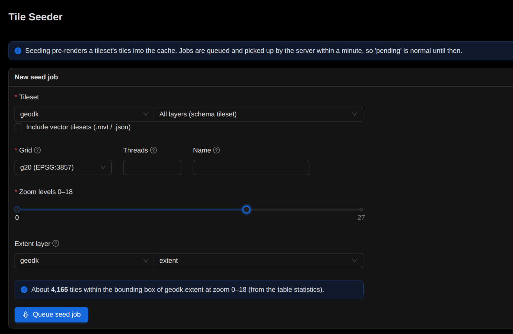

# Tile-seeding

Tiles kan seedes, som betyder, at tiles bliver skabt på forhånd. Seeding sker ved brugen af GC2-app eller GC2-cli værktøjet.

## GC2-app




## GC2-cli

Her er "help" outputtet fra seed:start kommandoen:

```
$ gc2 seed:start --help

Starts a seed job

USAGE
  $ gc2 seed:start

OPTIONS
  -e, --end=end          (required) End zoom level (the higher number)
  -f, --force            Force seed job - overwrites existing tiles
  -g, --grid=grid        (required) Grid to use
  -h, --help             show CLI help
  -l, --layer=layer      (required) Layer to seed [schema].[relation]
  -n, --name=name        (required) Name of seed job
  -s, --start=start      (required) Start zoom level (the lower number)
  -t, --threads=threads  Number of parallel threads that should be used to request tiles from the WMS source
  -x, --extent=extent    (required) Polygon layer which set the extent for the seeding [schema].[relation]
  ```

  ## Installation af gc2-cli i Windows

## Øvelse

- Start et seed job i GC2-app'en

