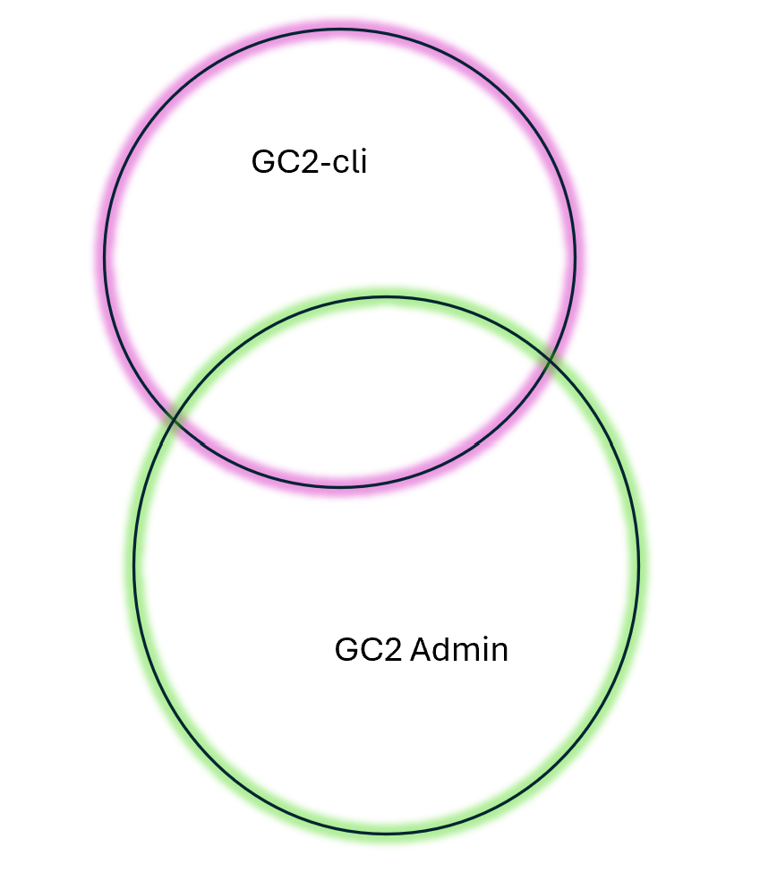

# Introduktion til GC2-cli

GC2-cli er et kommando-linje-værktøj til GC2. Værktøjet gør det lettere at anvende GC2s APIer uden for GC2 Admin web-brugerfladen.

Flere APIer, som er understøttet i GC2-cli er ikke tilgængelige i GC2 Admin. Det omvendte gør sig også gældende.

For at gennemføre denne workshop skal du have adgang til en GC2 instans version 2024.12.2 eller derover.

Du kan anvende denne [GC2/Vidi installation](https://test.admin.gc2.io/) hvor du kan oprette en database

Til øvelserne skal du bruge nogle test data. En pakke med data kan hentes [her](https://github.com/gc2vidi/workshops/raw/refs/heads/main/GC2-cli-introduktion/data/data.zip). Zip filen skal udpakkes.