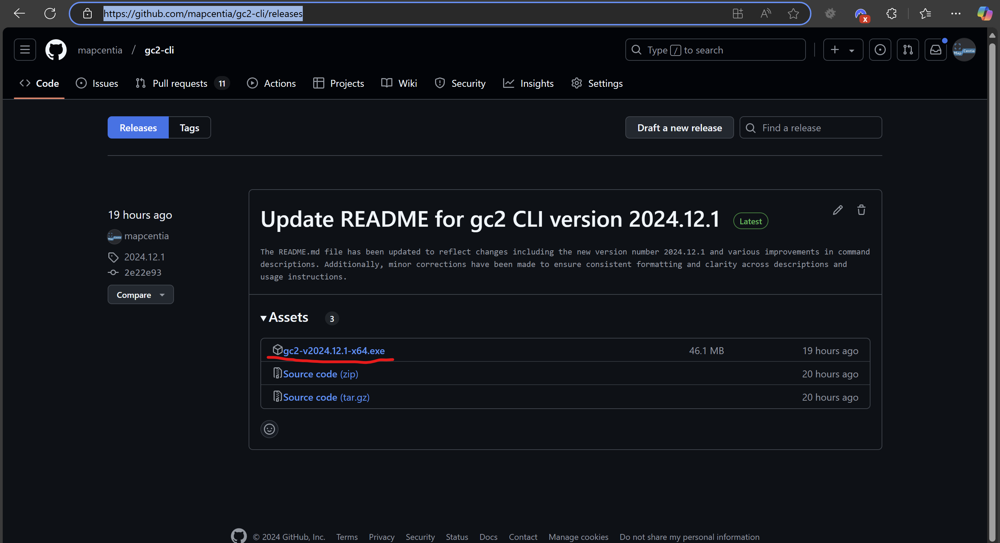
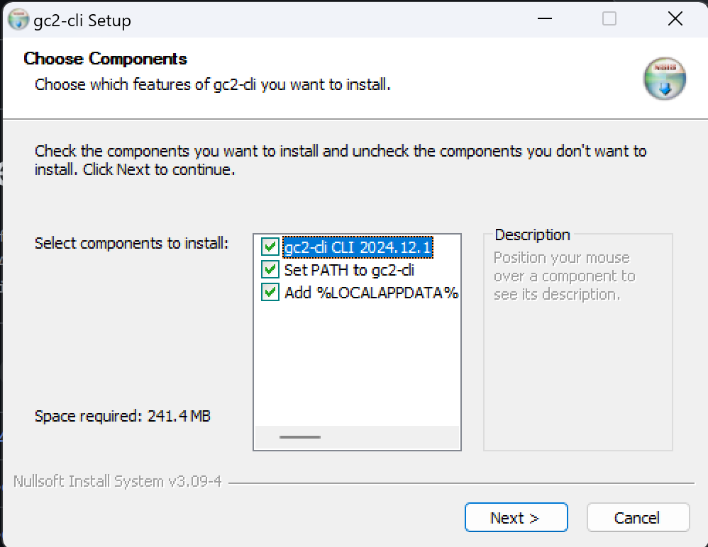

# Installering af GC2-cli

Der er to måder at installere GC2-cli på:

1. Download en installer.
2. Installer gennem npm.

## Download en installeren

Dette er den mest ligetil metode. Installeren vil sætte værktøjet op, og der er ikke andet, som skal gøres.

[Hent en installer her](https://github.com/mapcentia/gc2-cli/releases)



Kør installeren. Lad alle flueben forblive tjekket af.



## Installer gennem npm

Hvis man har npm (eller tilsvarende package manager) installeret, kan man installer sådan her:

```
npm install @mapcenti/gc2-cli --global
```

## Øvelse
- Installer gc2-cli på din PCer.
