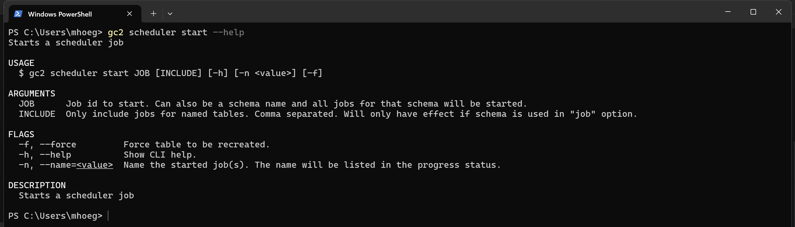

# Kommandoer

Kommandoer skal køres i en "terminal". På Windows bringes den op ved fx: Logo-knap og så skriv "powershell".

Det anbefales at installere Microsofts moderne terminal-app kaldet "Terminal".

Når terminalen er klar, så testes gc2-cli af ved at skrive gc2 og kommando-linjen og taste Enter.


Kommandoen gc2 skal altid efterfølges af en under-kommandoen. Mange under-kommandoer er grupperet i "topics". Fx alle kommandoer, som har med Scheduleren at gøre, er grupperet i "scheduler" topic.

Kommondoer skal typisk efterfølges af "argumenter" og evt. "flag". Gennem disse gives input til kommodoen.

En kommando er bygget sådan her op:

```shell
gc2 under-kommando argument1 argument2 --flag1 --flag2 værdi
```

Eller med topic:

```shell
gc2 topic under-kommando argument1 argument2 --flag1 --flag2 værdi
```

Argumenter er positions-styret så vil sige, at de skal komme i den rigtige rækkefølge. Flag er navne-styret, så de kan komme i vilkårlig rækkefølge og kan have en værdi.

Alle kommandoer har det specielle flag `--help` som bevirker, at hjælpe-teksten til kommondoen vises. Fx:

```shell
gc2 scheduler start --help
```



Under "Usage" ses hvordan kommandoen skal opbygges:

- `scheduler` er topic.
- `start` er under-kommando.
- `JOB` er første argument (bemærk store bogstaver).
- `[INCLUDE]` er andet argument. Ikke påkrævet (er i firkantede parenteser).
- `[-h]` er standard hjælpe-flaget. Ikke påkrævet.
- `[-n <value>]` er et flag, som skal efterfølges af en værdi. Ikke påkrævet.
- `[-f]` er et flag, som ikke skal have en værdi. Ikke påkrævet.

Nedenfor ses hjælpen til både argumenter og flag.

Så fx:

`gc2 scheduler start 12 -n lokalplaner -f`

Betyder start scheduler job 12 og kald proccessen 'lokalplaner' samt gennemtving oprettelse af ny tabel.

Flag har altid et kort og langt navn. Det er ligemeget hvilket man anvender. De lange er mere sigende, mens de korte er hurtigere at skrive.

## Et par fif

Vil man afbryde en kommando tastes Ctrl-c. Allerede kørte kommandoer kan kaldes frem igen ved at taste pil-opad.

## Øvelse

- Åben en terminal på din PCer ved fx at taste Logo-knap og skrive 'powershell'
- På kommando-linjen skrive gc2 og tast Enter. Du skulle gerne se output fra gc2-cli.
