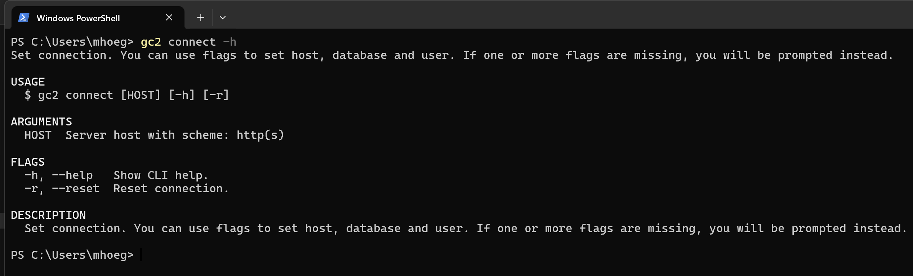

# Connect

Nu skal vi køre vores første rigtige kommando. Som det første skal gc2-cli forbindes til en GC2 instans. Det gøres med `gc2 connect`:



Denne kommondo er interaktiv. Det vil sige, at hvis den køres uden argument, vil den prompte dig for det. Så enten kør:

```shell
gc2 connect https://test.admin.gc2.io
```
Eller uden argument:

```shell
gc2 connect
```

## Øvelse

- Forbind gc2-cli til dig GC2 instans med `gc2 connect`.
- Kør `gc2 connect` igen og se, at forbindelsen er sat.