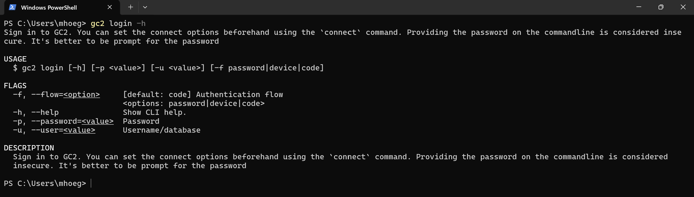

# Login

Langt de fleste kommandoer forbinder til GC2 og derfor skal man logge ind. Det gøres med `gc2 login`.

Login kan både ske ved angivelse af username og password på kommando-linjen eller det kan ske gennem en browser. Sidstnævnte er standard og giver den fordel, at hvis man er logget på GC2 Admin bliver man logget automatisk ind i gennem gc2-cli.



Køres `gc2 login` uden noget, bliver en browser med GC2 login åbnet. Hvis man er logget ind her, så logger gc2-cli på. Ellers venter gc2-cli på, at man får logget ind.

Hvis terminalen ikke kan åbne en browser, kan man angivelse af username og password på kommando-linjen. Det aktives ved brug af `--flow` flaget. Her bliver man promptet for username og password:

```shell
gc2 login --flow password
```
Og her i et hug:

```shell
gc2 login --flow password --user test --password abc123
```

En tredje mulighed er device flow, hvor en browser også anvendes. Men her skal man selv åbne login-siden på et device og taste en kode ind. Denne måde anvendes, når man vil logge ind gennem en browser, men terminalen ikke har mulighed for at åbne en.

```shell
gc2 login --flow device
```

## Øvelse

- Log ind ind. Prøv de forskellige muligheder.
