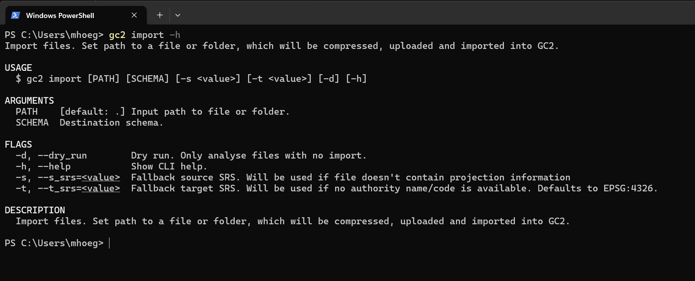

# Import af data

GC2-cli kan importere et enkelt filsæt eller alle filsæt i en mappestruktur. Fordelen ved at anvende GC2-cli er, at den uploade og impotere en hel mappestruktur samt komprimere filerne inden upload.

Der skal angives en sti til en fil eller en mappe (undermapper vil også blive med taget) samt det schema filerne skal importeres til.

Ved at anvende flaget `--dry_run` uploades filerne og analyseres, men de bliver IKKE importeret. På den måde kan man se, hvordan GC2 vil importere dem herunder geometri-type og projektion.

Hvis filerne mangler projektion og/eller EPSG kode, kan man angive disse med flagene `--s_srs` og `--t_srs`.



```shell
gc2 import ./data/ --dry_run
```

## Øvelse

- Download data pakken og udpak på din PCer eller anvend allerede eksisterende filer.
- Prøv at importere filerne til GC2.
- Opret evt. et nyt schema til dine data vha. `gc2 schema add`
