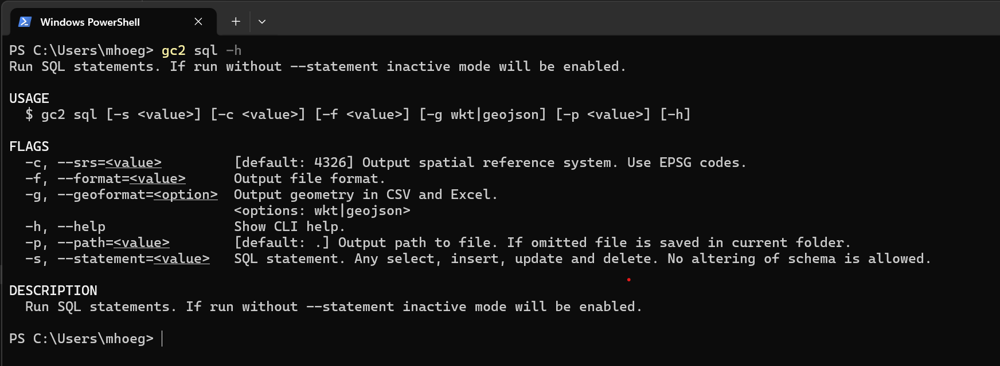

# Sql

Det er muligt at afvikle SQL gennem GC2-cli. Kun select, insert, update og delete er tilladt. Alle schema ændringer skal foretages gennem dedikerede under-kommandoer.

Kommandoen sql har et interaktivt mode og et, hvor resultatet hentes i et valgt filformat.




## Interaktiv mode

I interaktiv mode kan sende SQL statements og se resultat med det samme. Det er en god måde at se hvordan data ser ud:

```shell
gc2 sql
```

## Download af resultat

Ved at inputte SQLen vha. `--statement` flaget kan man downloade resultatet i et valgt filformat. Hvis `--format` flaget ikke sættes, vil man blive bedt om at vælge et.

Her dowbloades GeoFA data i MS Excel. Der vælges, at der skal geometrier med i WKT format.

```shell
gc2 sql --statement "select * from t_5800_fac_pkt limit 10" --srs 25832 --geoformat wkt --format excel --path t_5800_fac_pkt.xlsx
```

Eller download i et ogr understøttet format:

```shell
gc2 sql --statement "select * from t_5800_fac_pkt limit 10" --srs 25832 --geoformat wkt --format "ogr/ESRI Shapefile"
```

## Øvelser
- Kør SQLer på dine data i både interaktiv mode og downloading af data,
- Prøv at bruge `gc2 schema get` og `gc2 schema get` for at inspicere dine data. 
