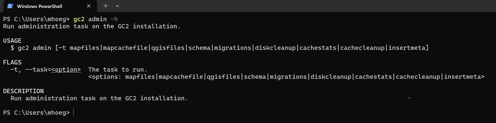

# Admin

Admin under-kommandoen giver mulighed for at afvikle en række administrations "tasks" i GC2 installationen. Et par stykker kan være ret nyttige at kende:



## Tøm applikations cachen

Operationer i database udenom GC2 Admin (eller GC2-cli) kan efterlade "stale cache" - "forældet cache". Al cache kan slettes ved:

```shell
gc2 admin --task cachecleanup
```

## Insert Meta til lag som mangler

Hvis en tabel eller view oprettes uden om GC2 Admin (eller GC2-cli) kan det ikke umiddelbart anvendes af gennem GC2, som det har fået et mininum af opsætning. Det sker automatisk gennem GC2 Admin, når man sætter en egenskabe (title, beskrivelse, gruppe mv).

Følgende kommando insert basis meta på alle lag, som ikke i forvejen har meta data tilknyttet:

```shell
gc2 admin --task insertmeta
```
