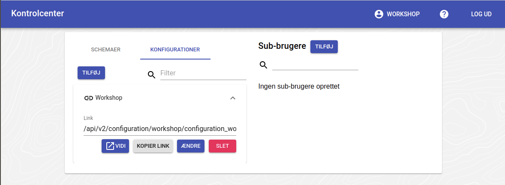
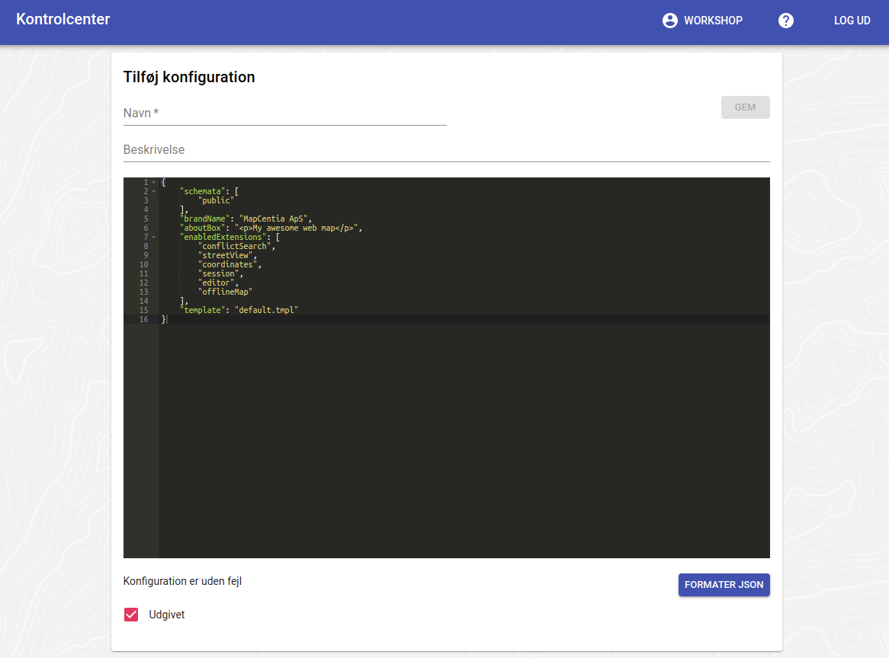

# Config-filer

Vidi er konfigureret gennem en fil på serveren (system config'en). Denne fils indstillinger kan ændres enkeltvis gennem såkaldte config-filer. Når Vidi startes, kan der angives en bestemt config-fil og indstillingerne i den vil så anvendes.

Den ønskede config-fil angives i URL'en til Vidi. Dette kan se sådan ud:

`https://vidi.swarm.gc2.io/app/workshop/?config=/api/v2/configuration/workshop/configuration_workshop_614ae80c2393c449148255.json`

## Config-fil systemet i GC2

Config-filer oprettes, ændres og slettes gennem GC2 Kontrolcenter, hvorfra Vidi også kan startes med en betstemt config:

   

   

## Config-fil syntax

Config-filer skrives i [JSON formatet](https://en.wikipedia.org/wiki/JSON) som er meget udbredt. Et eksempel kan se sådan ud:

```json
{
    "schemata": [
        "workshop"
    ],
    "brandName": "Workshop",
    "aboutBox": "Workshop demo"
}
```

JSON editoren i GC2 hjælper med at påpege evt. fejl i syntax'en.

## Mulige indstillinger i en config

Der er en lang række indstillinger, som kan skrives ind i en config. Den samlede liste kan ses [her](https://vidi.readthedocs.io/en/latest/pages/standard/91_run_configuration.html)

> Note: Hvis en instilling IKKE sættes i en config, bruges den som er sat i system config'en, som kan være variere mellem forskellige Vidi installationer.

## Øvelser

- Start med at oprette en config.
- Sæt `schemata` så nogle lag loades.
- Prøv at sætte forskellige indstillinger og se hvordan Vidi reagerer.

Dette er en samlet config som du kan copy/paste fra. Bemærk `schemata`, hvor der bruges en tag, så du skal huske at tagge dine lag med `workshop`. Schamaet `public` er medtaget for at have et start-udsnit. 

```json
{
    "schemata": [
        "public",
        "tag:workshop"
    ],
    "activeLayers": [
        "workshop.region",
        "workshop.kommune"
    ],
    "enabledExtensions": [
        "conflictSearch",
        "streetView",
        "session",
        "coordinates",
        "editor"
    ],
    "extensionConfig": {
        "conflictSearch": {
            "startBuffer": 2,
            "getProperty": true,
            "searchString": "tag:workshop",
            "searchLoadedLayers": true
        }
    },
    "brandName": "Workshop",
    "aboutBox": "Workshop demo",
    "startUpModal": "<h1>Velkommen til Vidi workshop</h1><p>Dette er en test af config og lag-meta.</p>",
    "template": "default.tmpl",
    "baseLayers": [
        {
            "id": "osm",
            "name": "Open Street Map",
            "minZoom": 8
        },
        {
            "type": "XYZ",
            "url": "https://m3.mapserver.mapy.cz/base-m/{z}-{x}-{y}?s=0.3&dm=Luminosity",
            "id": "mapy",
            "name": "Mapy",
            "description": "Kort fra Mapy",
            "attribution": "Mapy",
            "minZoom": 8,
            "maxZoom": 20,
            "maxNativeZoom": 19
        }
    ],
    "featureInfoTableOnMap": false,
    "crossMultiSelect": true,
    "activateMainTab": "info",
    "showLayerGroupCheckbox": true,
    "dontUseAdvancedBaseLayerSwitcher": true
}
```