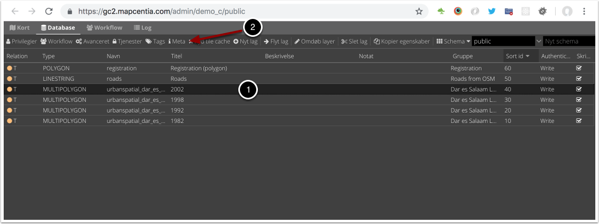
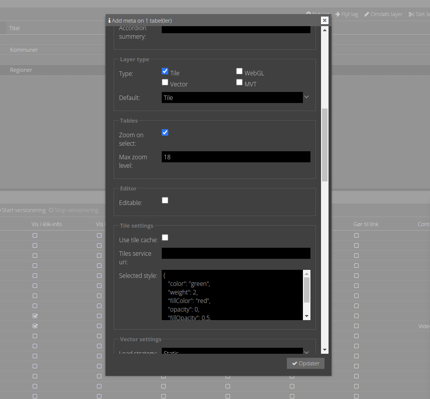

# Lag-egenskaber (Meta)

GC2 har et konfigurerbart Meta Data system med egenskaber tilknyttet de enkelte lag, som Vidi læser ved opstart. Egenskaberne omfatter fx om lag kan editeres, om et lag skal vises som tile- eller vektorlag osv. Meta egenskaber har kun betyding for Vidi og ikke WMS/WFS eller GC2 i det hele taget.

Her åbnes Meta formularen i GC2 Admin:  

   

Meta formularen indeholder en række input-felter, som styrer hvordan Vidi håndterer det pågældende lag:  

   

> Note: Meta formularen kan indeholde egenskaber, som ikke har noget med Vidi at gøre. Det kan være egenskaber til andre 3. parts systemer sådan CKAN, Wikis eller lign. Det er muligt i GC2 konfigurationen at tilføje flere egenskaber.

## Meta egenskaber for Vidi

En gennemgang af alle Meta egenskaber for Vidi kan ses [her](https://vidi.readthedocs.io/en/latest/pages/standard/92_gc2_meta_information.html#gc2-meta-information)

## Øvelser

- Indsæt Meta egenskaber for et lag og se hvordan laget i Vidi reagerer.

Herunder findes input til Meta for laget "region". Du kan copy/paste dem ind og evt. lave dine egne justeringer.

### Info pup-up

#### Pop-up template:

```handlebars
<h3>Dette er {{regionnavn}}</h3>
{{#if regionkode}}Den har kode {{regionkode}}{{/if}}
```

#### Accordion summery prefix:

```
Regioner
```

#### Accordion summery:

```
regionnavn
```

### Tile settings

#### Selected style:

```json
{
   "color": "green",
   "weight": 2,
   "fillColor": "red",
   "opacity": 0,
   "fillOpacity": 0.5,
   "dashSpeed": 5
}
```

### Vector settings:

#### Point to layer:

Dette virker kun på punkt-lag, så prøv at sætte det ind i `navne_p` laget.

```javascript
function(feature, latlng) {
    return L.marker(latlng, {
        icon: L.ExtraMarkers.icon({
            icon: 'fa-home',
            markerColor: 'blue',
            shape: 'circle',
            prefix: 'fa',
            iconColor: '#fff'
        })
    });
}
```

#### Style function:

```javascript
function(feature){
    return {
        "color": "green",
        "weight": 4,
        "fillColor": "green",
        "opacity": 0.8,
        "fillOpacity": 0.2
    }
}
```

### Filters

#### Filter config:


```json
[
    {"field": "regionnavn","operator": "="},
    {"field": "timeof_pub","operator": ">"}
]
```

#### Predefined filters:

```json
{
    "Region Sjælland": "regionkode='1085'",
    "Region Hovedstaden": "regionkode='1084'",
    "Region Syddanmark": "regionkode='1083'",
    "Region Midtjylland": "regionkode='1082'",
    "Region Nordjylland": "regionkode='1081'"
}
```

### Mouse over

#### Template:

```handlebars
{{regionnavn}}
```

### References

#### Referenced by:

```json
[
    {
        "rel": "workshop2.kommune",
        "parent_column": "regionkode",
        "child_column": "regionkode"
    }
]
```

### Layer tree

#### Sub group:

```
Undergrupe
```

### Open tools:

```json
["filters"]
```
