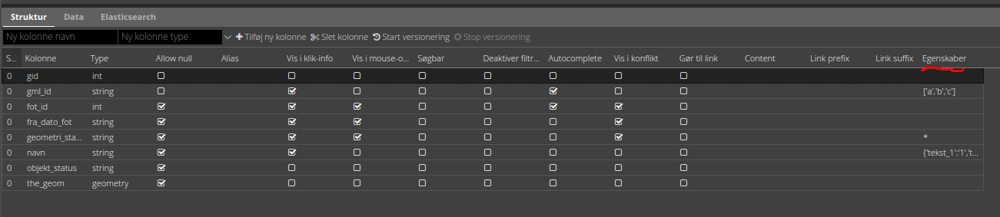

# Felt egenskaber

I GC2’s struktur-fane kan der laves en række indstillinger på feltniveau. Disse indstillinger styrer hvordan feltet virker i info-pop-up, filter mv.


   

## Felt egenskaber for Vidi

En gennemgang af alle felt indstillinger for Vidi kan ses [her](https://vidi.readthedocs.io/en/latest/pages/standard/92_gc2_meta_information.html#gc2-struktur-fanen)


## Øvelser

- Indsæt Meta egenskaber for et lag og se hvordan laget i Vidi reagerer.

Herunder findes input til felter for laget `navne_p`. Du kan copy/paste dem ind og evt. lave dine egne justeringer. 

> Note: JSON her strengene skal anvende single-qoutes ' og ikke double-qoutes ". Der erbejdes på at double også kan anvendes.

* I feltet `feat_type` indsæt i `Egenskaber` tegnet `*` og se, at der kommer en drop-down vælger i filter og editering.

* I feltet `navn` tjek `Autocomplete` af og se, at der kommer autocomplete i filteret.

* I feltet `godkendt` prøv i `Egenskaber` at skifte mellem:

```json
[0, 1, 2]
```

```json
{"Nej": 0, "Ja": 1, "Ved ikke": 2}
```

```json
{"_rel":"public.ja_nej", "_value":"kode", "_text":"tekst"}
```
