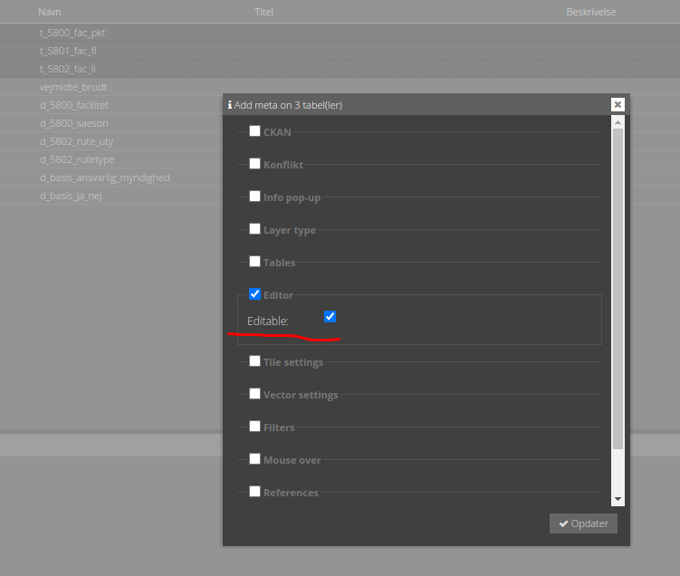
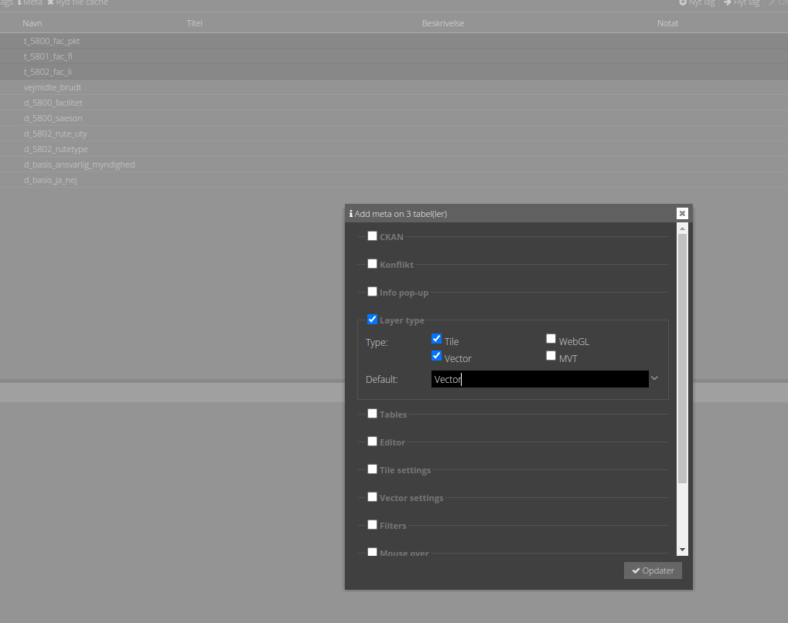
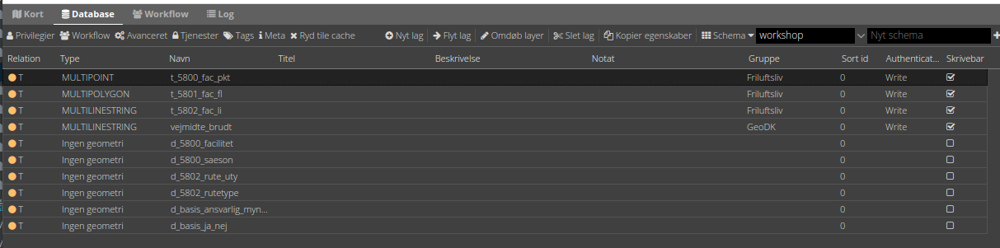

# Basisopsætning

Editeringsfunktionaliteten kommer gennem en extension kaldet `editor`. Når denne er aktiveret i en config, kan lag
editeres. Dog skal de enkelt lag have editering aktiveret gennem Meta funktionen.

I fleste tilfælde skal brugeren have rettigheder til at ændre på et lag, så `session` extension skal også være
aktiveret, således brugeren kan logge sig ind.

## Øvelse

1. Start med at upload datasættene. Evt. til et schama kaldet `workshop`. Alle data skal uploades med encoding UTF8 og
   EPSG:25832 (csv filerne indeholder ikke geometri, så her er EPSG underordnet).
2. Opret en ny config i Kontrolcenter med følgende indhold:

```json
{
  "schemata": [
    "workshop"
  ],
  "enabledExtensions": [
    "editor",
    "session"
  ]
}
```

3. Tjek af i Meta > Editor > Editable



4. Vælg både Tile og Vector i Meta > Layer type



5. Placer alle geometri-lag i grupper og søg for at `Write` er sat i `Authentication`.



