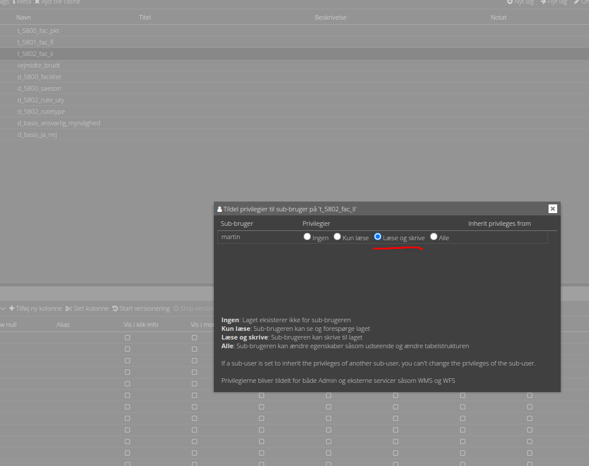

# Brugerstyring

Typisk vil man have kontrol over hvem, der må editere de enkelte lag. Her er det en god ide, at oprette sub-brugere til
de forskellige personer og organisationer, der skal kunne editere.

En sub-bruger er en bruger, som er tilknyttet databasen. En sub-bruger har som udgangspunkt ikke rettigheder til nogle
lag.

# Øvelse

1. Opret en sub-bruger i Kontrolcenter.
2. Tildel `Læse og skrive` privilegier til sub-brugeren på tre frilufts-lag.

