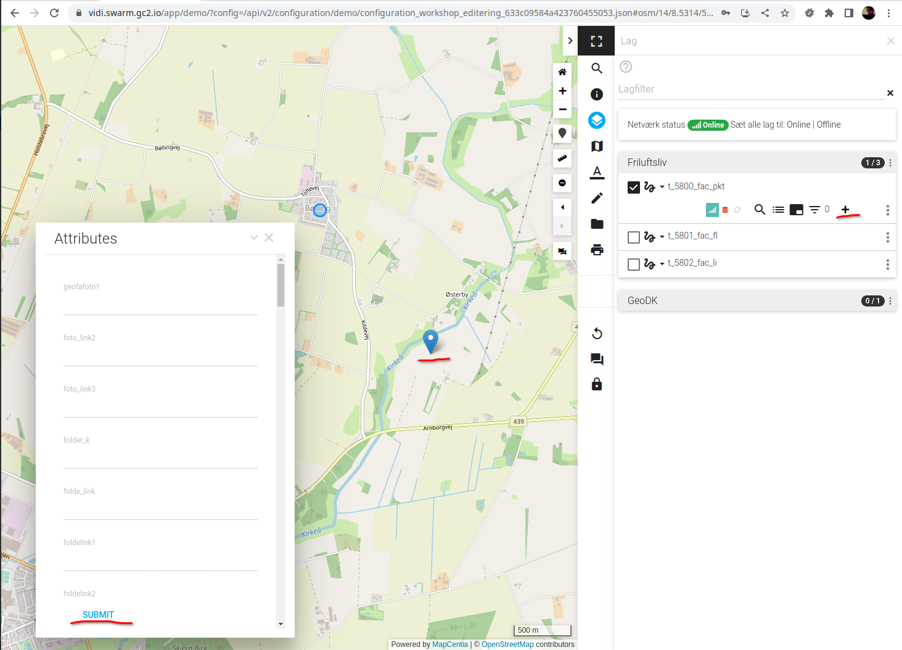
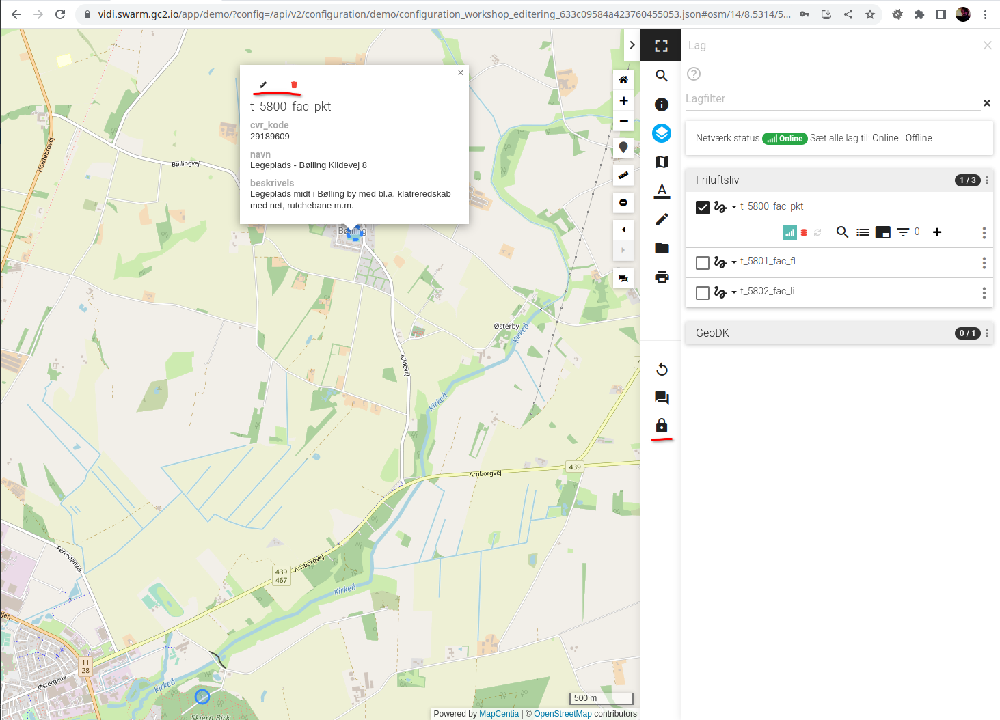
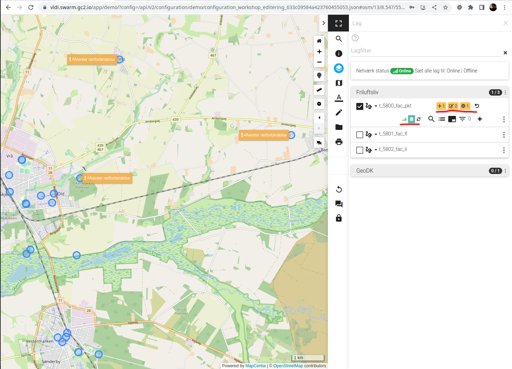

# Editering

Alt efter om man vil indsætte en feature eller opdatere/slette en eksisterende startes editering på forskellig vis.

## Indsæt ny feature

1. Tænd laget, som du vil indsætte ind.
2. Klik på plus-ikonet.
3. Alt efter laget er punkt, linje eller flade kan du nu plotte et punkt, linje eller flade. De sidstnævnte afsluttes
   ved at klikke en gang til på det sidst plottet punkt.
4. Attribut formularen udfyldes.
5. Der klikkes på `SUBMIT` knappen nederst på formularen for at afslutte oprettelsen.

Punkt 3 og 4 kan ombyttes.

## Opdater eksisterende feature

1. Tænd laget, som du vil opdatere.
2. Klik på den feature du vil editere. Hvis lag er raster-udgaven, så skal Info værktøjet aktiveres først.
3. I pop-up'en er der to ikoner: En blyant og en affaldsspand. Klik på blyanten.
4. Nu ses attribut formularen og det er muligt at ændre geometrien. Lav de ønskede ændringer.
5. Der klikkes på `SUBMIT` knappen nederst på formularen for at afslutte opdateringen.

## Slet feature

1. Tænd laget, som du vil opdatere.
2. Klik på den feature du ønsker at slette. Hvis lag er raster-udgaven, så skal Info værktøjet aktiveres først.
3. I pop-up'en er der to ikoner: En blyant og en affaldsspand. Klik på affaldsspand.
4. Klik `OK` i dialogen.

I alle ovenstående tilfælde kræves log ind. Man kan starte med at logge ind eller vente til, at man er færdig med at
editere. Vælges det sidste vil transaktionskøen ikke løbende bliver afviklet, men først når man logger ind.

## Offline mode

Hvis der ikke er netværk, vil transaktionskøen ikke blive afviklet. Man kan også vælge at sætte et lag i vektor-udgave
"offline mode". I dette tilfælde vil transaktionskøen ikke løbende blive afviklet. Faktisk vil køen slette ikke prøve af
forbinde til GC2 - heller ikke hvis laget slukkes/tændes. Det kan anvendes i disse situationer:

1. Hvis laver en række ændringer over tid men ønsker, at de først bliver sendt til GC2/databasen når alle er lavet.
2. Hvis man er ude i marken og har meget svag netværksforbindelse og køen "hænger". Så kan man vente til, at man har bedre
   forbindelse og afvikle køen.

## Øvelser

Prøv at editere et lag i både raster og vektor udgave. Prøv også at være både logget ud og ind.

I vektor-udgave prøv at sætte laget i offline-mode og lave editeringer. Skift tilbage til online mode og se køen blive
afviklet.  

