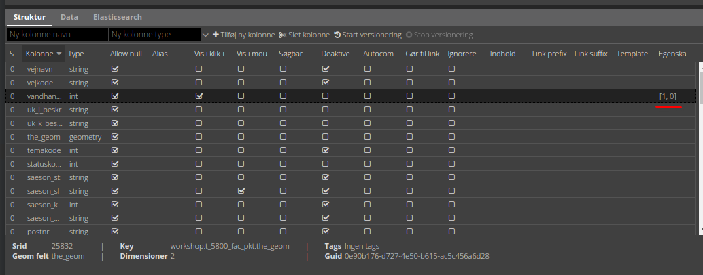

# Opsætning af formular

Attribut formularen bliver dannet ud fra typerne i PostGIS tabellen.

Fx bliver et `timestamp` felt til en datovælger i formularen og et `boolean` felt bliver til en tjek-boks. Det betyder, 
at det er udelukkede typerne i PostGIS, der styrer inputfelterne i formularen.   

Der er en felttype i PostGIS kaldet `bytea`. Det er til binær data. Da det typisk er billeder, man gemmer i et sådan 
felt, bliver denne felttyper til et billede-felt. På devices, som kan tage billeder, får man adgang til kamera og fotorulle. 
På andre devices kan der vælges et foto fra filsystemet.

> **_Bemærk:_** at billeder ikke bliver gemt som filer, men en "blob" i tabellen. Vidi kan vise billederne info-pop-up,
> men det er nødvendigt at decode data for at få en JPEG fil ud.

Det er muligt at gøre tal- og tekst-felttyper til "drop-down"-felter, således kun bestemte værdier kan indtastes.   

> **_Bemærk:_** at drop-down indstillinger også virker på filter-funktionen.

Værdier i listen kan angives på fire måder:

### Reference-tabel

Værdier kan komme fra en anden tabel i databasen. Dette angives ved tre parameter i et JSON objekt:

```json
{"_rel": "schema.tabel", "_value": "feltnavn", "_text": "feltnavn"}  
``` 

`_rel` angiver reference-tabellen (eller view) som schema-kvalificeret (schema-navnet skal angives foran tabelnavnet).

`_value` angiver feltet, som indeholder værdierne.

`_text` angiver feltet, som indeholder den tekst, der skal vises i drop-down-listen. Dette felt kan godt være det samme
som ovenstående _value felt.

### Værdi-tekst liste

Værdier kan angive som en liste af værdi-tekst par i et JSON objekt. Dvs. at det er teksten (venstre side), som bliver
vist i drop-down-listen, mens værdien (højre side) bliver anvendt.

```json
{"tekst_1": "1", "tekst_2": "2", "tekst_3": "3"}
```

### Værdi liste

Værdier kan angives som en liste i et JSON array. Værdierne bliver vist i drop-down-listen.

```json
[1, 2, 3]
```

Listen kan både bestå af tal og tekster.

> **_Bemærk:_** at hvis en værdi skal opfattes som et tal, skal der __ikke__ `"` omkring. Derimod skal tekst altid have `"` omkring. 

### Wild card

Der kan dannes en drop-down-liste af samtlige unikke værdier som allerede findes i feltet. Det gøres ved at indsætte `* i
feltet. Dette er dog ikke så anvendelig ved editering og er nok bedre anvendt på filterfunktionen.

### Foreign constrains

Hvis et felt har såkaldte foreign constrains i databasen, vil disse bliver listet i drop-down-listen. Dette kræver adgang
til databasen, så det ligger udenfor denne workshop.

[Link til manualen](https://vidi.readthedocs.io/da/latest/pages/standard/92_gc2_meta_information.html#egenskaber)

## Øvelse

1. Upload csv filerne i databasen. Følgende forudsætter, at de er uploaded til schemaet `workshop`.

2. I friluftsliv-lagene er der en del Ja/nej felter. I laget `t_5800_fac_pkt` prøv først at indsætte i `Egenskaber` for feltet `vandhane_k`:

```json
[1, 0]
```



og skift ud med:

```json
{"Ja": 1, "Nej": 0}
```

> **_Bemærk:_** at `vandhane_k` er et heltalsfelt, så værdier må ikke have `"` omkring

Og til sidst prøv denne reference-tabel: 

```json
{"_rel":"workshop.d_basis_ja_nej", "_value":"ja_nej_kode", "_text":"ja_nej"}
```

Prøv at anvende en andre reference-tabeller. 

I feltet `cvr_kode` kan `d_basis_ansvarlig_myndighed` anvendes således:

```json
{"_rel":"workshop.d_basis_ansvarlig_myndighed", "_value":"cvr_kode", "_text":"cvr_navn"}
```

I feltet `facil_ty_k` kan `d_5800_facilitet` anvendes således: (kan kun anvendes i `t_5800_fac_pkt` og `t_5801_fac_fl)

```json
{"_rel":"workshop.d_5800_facilitet", "_value":"facil_ty_k", "_text":"facil_ty"}
```


