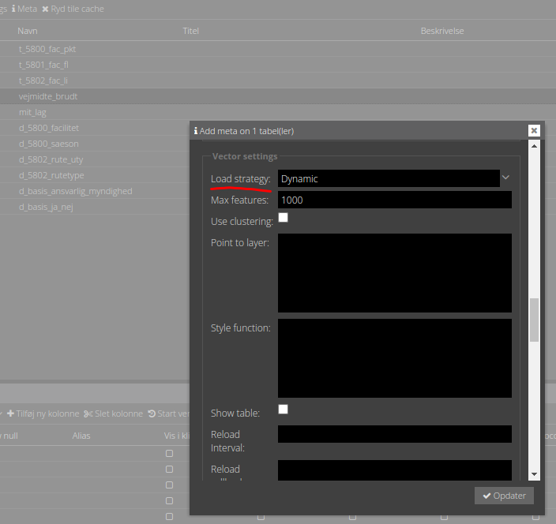

## Snapping

Når man plotter geometrier bliver der snappet til alle synlige vektor-lag, inklusiv laget selv.

Hvis man vil snappe til et større lag fx vejmidter eller jordstykker, som ikke kan vises som vektor-lag i deres helhed,
kan "dynamisk load" aktiveres.

Dynamisk load betyder, at der kun hentes data, som dækker kortudsnittet samt en buffer udenom. Når kortudsnittet skifter, 
bliver der hentet nye data - hvis det er nødvendigt.   

Indstillingen `Max features` styrer hvornår data vises. Det er altså ikke et spørgsmål om hvorvidt man er over en bestemt
zoom level.

Dynamisk load aktivere i Meta > Vektor settings > Load strategy

## Øvelse

Forbered laget `vejmidte_brudt` til snap-lag.

1. Sæt typen til vektorlag.
2. Sæt `Load strategy` til `Dynamic` og vælg en passende `Max feature`
3. Giv evt. laget en passende styling.
4. Prøv at plotte en rute i laget `t_5802_fac_li` ved at snappe til vejmidterne.
