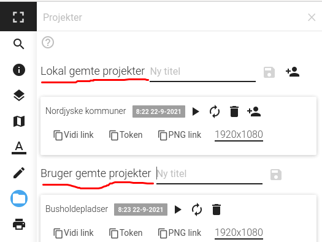

# Projekter

Projekt-modulet gør det muligt at gemme tilstanden af Vidi på serveren. Derved kan en given tilstand gendannes. Et projekt gemmes under et selvvalgt navn.

Projekter kan gemmes på to måder: Lokalt eller under en brugerprofil.

## Lokal gemte projekter

Projektet bliver gemt på serveren, men referencen til det er knyttet til browser-sessionen. Dvs. at projektet kan ses på listen og ændres så længe der anvendes den samme browser og browser-cachen ikke er ryddet. Mistes referencen til projektet vil det stadig eksistere, men kan ikke ændres eller slettes.

## Bruger gemte projekter

Er man logget ind i Vidi kan projektet gemmes under ens bruger-profil. På denne måde kan man altid se projektet på listen og det kan ændres/slettes fra en hvilken som helst browser.

**Brug altid Bruger gemte projekter!**   

[Video af Vidi projekter](https://vimeo.com/611421748)   

## Øvelse

- Opret et lokalt projekt.
- Log ind og opret et bruger projekt.
- Prøv at flytte det lokale projekt til et bruger projekt.

[Dokumentation af Projekter](https://vidi.readthedocs.io/da/latest/pages/standard/06_project.html)

