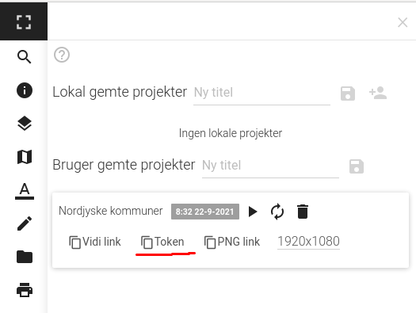

# Indlejring på hjemmeside

Indlejring af Vidi på en hjemmeside tager altid udgangspunkt i et specifikt projekt. For at kunne indlejre Vidi, skal man have styr på tre ting:

1. embed.js scriptet
2. Projekt token
3. HTML koden for selve Vidi elementet.

## 1. embed.js script

Vidi kan indlejres på en hjemmeside vha. embed.js scriptet. Dette script skal loades på hjemmesiden, hvor Vidi skal indlejres.

Scriptet skal ikke nødvendigvis hentes fra samme server, hvor Vidi findes. Man kan fx selv hoste scriptet eller placere det inline på sin hjemmeside.

      

Scriptet kan både placeres i toppen og bunden af hjemmesiden.

I CMS sammenhæng er det typisk, at script taggen bliver skrevet ind i side-skabelonen, så side-forfatteren ikke skal tænke videre over det.  

## 2. Projekt token

Projektets "token" sindeholder projekt-id, host, database mv. Tokens er kodet, så de ligner en række tilfældige bogstaver, men det er de ikke.

Kodet:

    eyJpZCI6InN0YXRlX3NuYXBzaG90X2UwMGQ4ZTIwLTFiNmUtMTFlYy04M2EwLTM5NzJhYWM0MTU2NCIsImhvc3QiOiJodHRwOi8vMTI3LjAuMC4xOjMwMDAiLCJ0aXRsZSI6Ik5vcmRqeXNrZSBrb21tdW5lciIsInNjaGVtYSI6IndvcmtzaG9wIiwidXNlcklkIjoibXlkYiIsImRhdGFiYXNlIjoibXlkYiIsInNuYXBzaG90IjpmYWxzZSwiYW5vbnltb3VzIjpmYWxzZSwiYnJvd3NlcklkIjpmYWxzZSwiY3JlYXRlZF9hdCI6IjIwMjEtMDktMjJUMDY6MzI6MzYuMDk4WiIsInVwZGF0ZWRfYXQiOiIyMDIxLTA5LTIyVDA2OjMyOjM2LjA5OFoiLCJjb25maWciOiIvYXBpL3YyL2NvbmZpZ3VyYXRpb24vbXlkYi9jb25maWd1cmF0aW9uX3dvcmtzaG9wXzYxNGFkYTM0ODNlYTI5NzMxMDM0ODQuanNvbiJ9   

Ukodet:

    {"id":"state_snapshot_e00d8e20-1b6e-11ec-83a0-3972aac41564","host":"http://127.0.0.1:3000","title":"Nordjyske kommuner","schema":"workshop","userId":"mydb","database":"mydb","snapshot":false,"anonymous":false,"browserId":false,"created_at":"2021-09-22T06:32:36.098Z","updated_at":"2021-09-22T06:32:36.098Z","config":"/api/v2/configuration/mydb/configuration_workshop_614ada3483ea2973103484.json"}

## 3. HTML koden for Vidi elementet

Denne kode-stump indsættes der, hvor kortet ønskes. Det er et såkaldt "div tag", som er tomt, men embed.js scriptet finder den og indsætter Vidi i det:

    

Vha. en række "data-attributter" kan det indlejrede kort gives nogle forskellige egenskaber. Følgende er de data-attributter, som kan anvendes. Hvis de ikke anvendes vil en standard værdi blive brugt.

* **data-vidi-width**

    * Bredde på kort. Bruger css syntax. Fx "500px" eller "100%". Standard 100%

* **data-vidi-height**

    - Højde på kort. Bruger css syntax. Fx "500px" eller "100%". standard 100%

* **data-vidi-tmpl**

    - Hvilken template kortet skal bruge. Standard embed.tmpl, som er en template beregnet til indlejring.

* **data-vidi-search**

    - Kan sættes til “none” hvis søgeboksen skal skjules. Standard ikke sat.

* **data-vidi-history**

    - Kan sættes til “none” hvis forrige/næste udsnit kanpperne skal skjules. Standard ikke sat.

* **data-vidi-use-config**

    - Kan sættes til “true” og derved bruges config’en fra token, hvis den indeholder en config.

* **data-vidi-use-schema**

    - Kan sættes til “true” og derved bruges schemaet fra token, hvis den indeholder et schema.

* **data-vidi-host**

    - Kan sættes til en host (fx “https://example.com”) som bruges i stedet for host angivet i token.

* **data-vidi-frame-name**

    - Navn på det indsatte kort. Dette er nødvendig hvis Embed API skal anvendes.

### Eksemple på brugen af data-attributter

Data-attributter skrives sådledes. Rækkefølgen er underordnet:

    

Kan også skrives på flere linjer, så det bliver lettere at læse:

    

## Øvelse
1. Indsæt embed.js scriptet på en hjemmeside. Spring evt. dette over og anvend [eksempel.html](../eksempel.html) filen.
2. Indsæt en div tag på hjemmesiden.
3. Kopier token fra et Vidi projekt og indsæt denne i `data-vidi-token` i div taggen.
4. Sæt `data-vidi-width` og `data-vidi-height til hhv. "800px" og "600px"
5. Gem hjemmesiden og åben den i en browser.
6. Prøv at ændre/tilføje data-attributter og se hvad der sker med kortet.

[Dokumentation af Indlejring af Vidi på andre hjemmesider](https://vidi.readthedocs.io/en/latest/pages/standard/95_embed.html)
