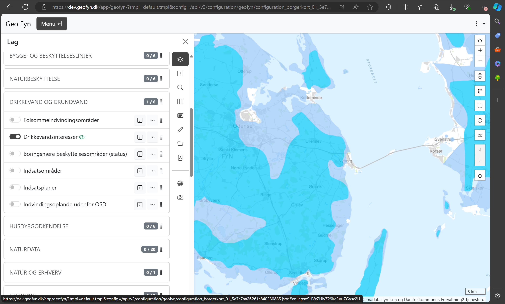

# Øndringer i embed

Både default og embed udgaverne af Vidi er lavet om. Før var det to ret forskellige udgaver af Vidi. Det betød, at visse funktioner i default-udgaven ikke kunne aktiveres i embed-udgaven.

I Ny Vidi er default og embed templates teknisk set ens. Sidstnævnt har blot "slukket" for en del dialoger og funktioner og flyttet lidt rundt på tingene. Det betyder, at fx alle kortværktøjer (fx måleværktøjet) også er tilgængeligt i embed.


  

## Følgende attributer styrer hvilke funktioner, der skal være synlige.

For ikke, at der skal være forskel i funktionerne i embed efter en opgradering, vil nogle værktøjer være slukket for i udgangspunktet og dem, som var tændt i udgangspunktet vil være stadig være tændt.

### Følgende funktioner er synlige, men kan sættes til »none« hvis funktionerne skal skjules:

- data-vidi-search (valgfri)
    - Søgeboksen (Findes kun i embed).
    
- data-vidi-history (valgfri)
    - Forrige/næste udsnit knapperne.

- data-vidi-legend (valgfri)
    - Signatur-knappen (Findes kun i embed).

- data-vidi-layer (valgfri)
    - Lag-knappen (Menu-knappen).

- data-vidi-background (valgfri)
    - Baggrund-knappen (Findes kun i embed).

- data-vidi-fullscreen (valgfri)
    - Fuldskærms-knappen.

- data-vidi-about (valgfri)
    - Om-knappen (Findes kun i embed).

- data-vidi-location (valgfri)
    - Find-mig-knappen.

- data-vidi-signin (valgfri)
    - Login-knappen. 

- data-vidi-toggler (valgfri)
    - Navbar toggle-knappen, som vises i på smal skærm.

### Følgende funktioner er skjulte, men kan sættes til »inline« hvis funktionerne skal være synlige:

- data-vidi-measurement (valgfri)
    - Måleværktøjet.

- data-vidi-boxzoom (valgfri)
    - »Elastik«-zoom-knappen.

- data-vidi-reset (valgfri)
    - Reset-knappen (Findes kun i embed).

- data-vidi-clear (valgfri)
    - Ryd-kort-knappen.

- data-vidi-screenshot (valgfri)
    - Screenshot-knappen.
  
Manualen vedr. embed kan ses [her](https://vidi.readthedocs.io/da/latest/pages/standard/95_embed.html)

Og Vidi Embed Workshop kan ses [her](https://gc2vidi.github.io/workshops/Vidi-embed/)

## Baggrundskortsvælgeren i embed

Embed udgaven af Vidi har fået sin egen baggrundskort widget, som er placeret sammen med de andre kortværktøjer i højre sin.

Knappen bliver aktiveret automatisk, når Vidi anvender embed template. Hvis der ikke instilles noget i config, vil knappen skifte mellem de to først definerede baggrundskort i `baseLayers`. For at knappen indeholder en thumbnail, skal denne indstilles i "thumbnail". Det skal være en URL til et 60x60 px stort billed.

Hvis "thumbnail" ikke indstilles, vil knappen være helt blank, hvilket nedsætter brugervenligheden en helt del.   

```json
{
     "baseLayers": [
        {
            "thumbnail": "https://mapcentia.github.io/vidi_configs_common/forvaltningskort.png",
            "type": "wms",
            "url": "https://api.dataforsyningen.dk/forvaltning2?token=0b2892e76cf602dccdac0a9fc0f6a715",
            "layers": [
                "Basis_kort"
            ],
            "id": "dataforsyningen.sagsbehandlingskort",
            "name": "Topografisk kort, lavkontrast (løbende ajourført)" 
        },
        {
            "thumbnail": "https://mapcentia.github.io/vidi_configs_common/nfkort.png",
            "type": "wms",
            "url": "https://api.dataforsyningen.dk/wms/natur_friluftskort?token=0b2892e76cf602dccdac0a9fc0f6a715",
            "layers": [
                "Natur_Friluft_basis"
            ],
            "id": "dataforsyningen.natur_og_friluftskort",
            "name": "Topografisk kort, natur- og fritidsformål"
        }
    ]
}

```

I tilfælde af, at man vil have mere end to baggrundskort tilrådighed, skal bruger "baggrundskort-skuffen". Det gøres således. Hvert kort, der skal i skuffen, skal have `"inDrawer": true`

```json
{
    "baselayerDrawer": true,
    "baseLayers": [
         {
            "inDrawer": true,
            "thumbnail": "https://mapcentia.github.io/vidi_configs_common/forvaltningskort.png",
            "type": "wms",
            "url": "https://api.dataforsyningen.dk/forvaltning2?token=0b2892e76cf602dccdac0a9fc0f6a715",
            "layers": [
                "Basis_kort"
            ],
            "id": "dataforsyningen.sagsbehandlingskort",
            "name": "Topografisk kort, lavkontrast (løbende ajourført)"
        },
        {
            "inDrawer": true,
            "thumbnail": "https://mapcentia.github.io/vidi_configs_common/nfkort.png",
            "type": "wms",
            "url": "https://api.dataforsyningen.dk/wms/natur_friluftskort?token=0b2892e76cf602dccdac0a9fc0f6a715",
            "layers": [
                "Natur_Friluft_basis"
            ],
            "id": "dataforsyningen.natur_og_friluftskort",
            "name": "Topografisk kort, natur- og fritidsformål"

        },
        {
            "inDrawer": true,
            "type": "wms",
            "thumbnail": "https://mapcentia.github.io/vidi_configs_common/orto.png",
            "url": "https://api.dataforsyningen.dk/orto_sommer_2022?token=0b2892e76cf602dccdac0a9fc0f6a715",
            "layers": [
                "orto_sommer_2022"
            ],
            "id": "orto_sommer_2022",
            "name": "Luftfoto"
        }
    ]
}

```

## Øvelse
1. Lav en config med embed template OG extension.
2. Lav en `baseLayer` opsætning med hhv. baggrundskort-skifter og -skuffe.