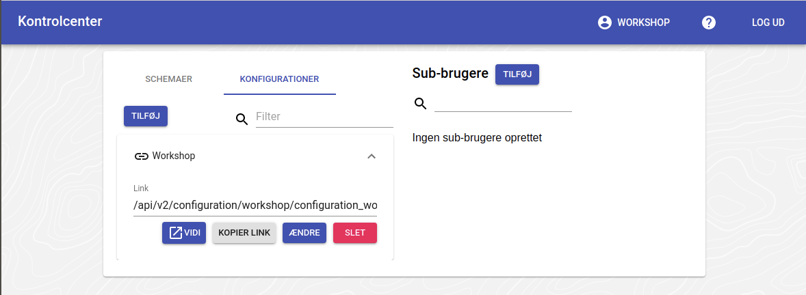
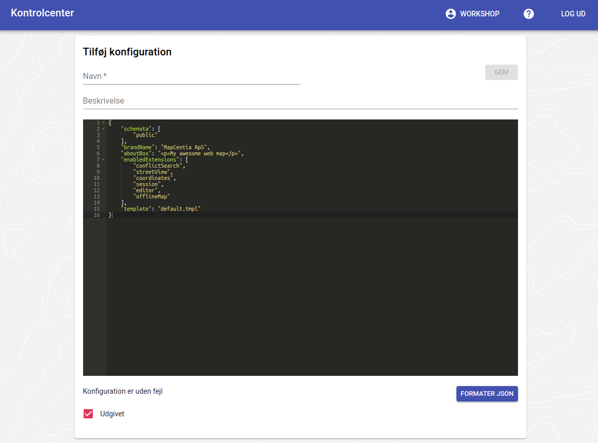

# Config-filer

Vidi er konfigureret gennem en fil på serveren (system config'en). Denne fils indstillinger kan ændres enkeltvis gennem såkaldte config-filer. Når Vidi startes, kan der angives en bestemt config-fil og indstillingerne i den vil så anvendes.

Den ønskede config-fil angives i URL'en til Vidi. Dette kan se sådan ud:

`https://test.vidi.gc2.io/app/workshop/?config=/api/v2/configuration/workshop/configuration_workshop_614ae80c2393c449148255.json`

## Config-fil systemet i GC2

Config-filer oprettes, ændres og slettes gennem GC2 Kontrolcenter, hvorfra Vidi også kan startes med en betstemt config:

   



## Ændringer i config-filer fra gammel til ny Vidi

Der er nogle få egenskaber, som er blevet fjernet og erstattet af andre i Ny Vidi:

`embed` egenskaberne i `extensionConfig` er fjernet:

```json
{
    "extensionConfig": {
        "embed": {
            "slideOutLayerTree": true,
            "expandFirstInLayerTree": true
        }
    }
}
```
De er erstattet af to generelle egenskaber:

```json
{
    "showOffcanvas": true,
    "expandFirstInLayerTree": true
}
```

Det skyldes, at der rent teknisk ikke er forskel på embed og default templates i Ny Vidi, så disse to egenskaber fungerer i begge templates.

`showOffcanvas` kan nu også sætte til `mobile`. I dette tilfælde vil side-panelet blive vist fra starten medmindre, at Vidi vises på en smal skærm/vindue. Fx på telefon.

Manualen vedr. config kan ses [her](https://vidi.readthedocs.io/da/latest/pages/standard/91_run_configuration.html)

Og workshoppen [Vidi config-filer og lag-/felt-indstillinger - modul 01](https://gc2vidi.github.io/workshops/Vidi-config-files/01-Config-filer/) omhandler hvordan configs laves.

# Øvelse
1. Opret en config med de to nye indstillinger.
2. Sæt `showOffcanvas` til `true`
3. Sæt `expandFirstInLayerTree` til de tre forskellige muligheder og se hvordan det virker i hhv. bred og smal skærm.