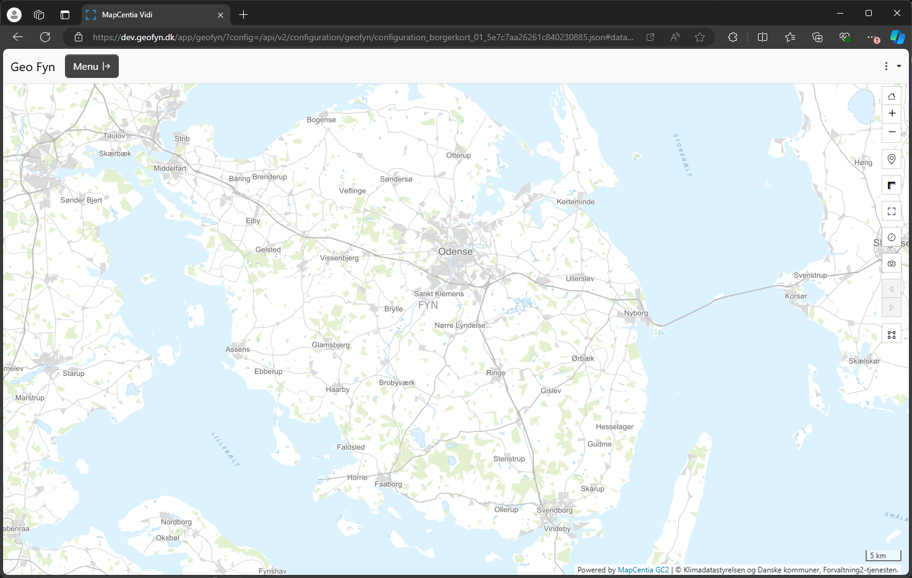
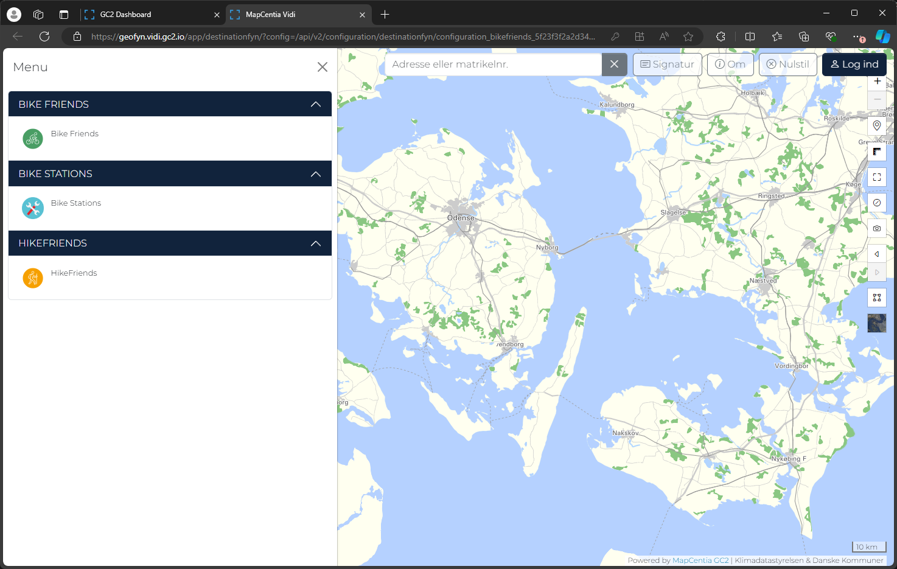
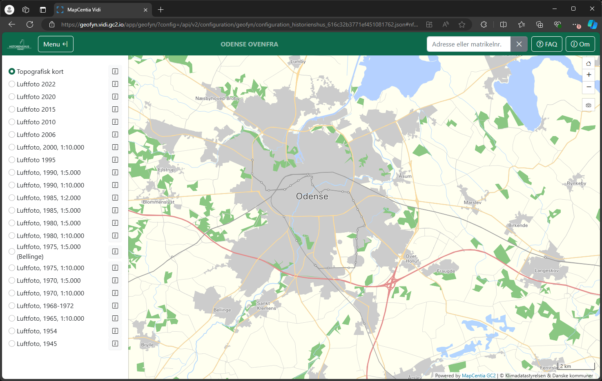
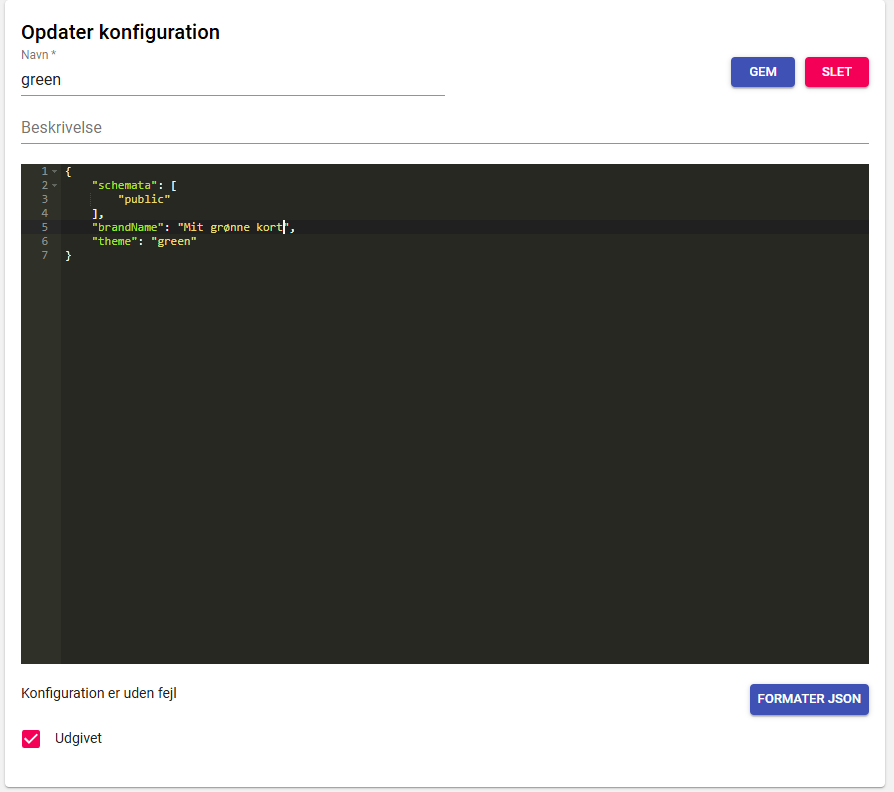

# Nye muligheder med themes

Bootstrap understøtter nu ["themes" eller "color modes"](https://getbootstrap.com/docs/5.3/customize/color-modes/)

Dette gør det muligt at skifte mellem forskellige brugerdefinerede "themes".

Udgangspunktet er et standard-theme, og man definerer så nogle css værdier, som overskriver eksisterende værier.







Det er ikke kun farver, som kan overskrives, men i princippet alt css, som man hidtil har gjort gennem eksterne style-sheets.

Fx eksemplet fra modul 04 kan laves som et theme sådan her:

```scss
[data-bs-theme="green"] {
  --bs-body-bg: lightgreen;
  --bs-body-font-family: 'Montserrat', sans-serif;
}
```

Ovenstående lægges i `scss/themes.scss` og i bygge processen vil temaet blive dannet. Filen kan indeholde flere themes i formen:

```scss
[data-bs-theme="green"] {
  --bs-body-bg: green;
}
[data-bs-theme="blue"] {
  --bs-body-bg: blue;
}
[data-bs-theme="red"] {
  --bs-body-bg: red;
}
```

Efterfølgende kan themes anvendes i configs på følgende måde:



## Light og Dark theme

Vidi komnmer med to klar-til-brug themes: light og dark

Light anvendes hvis ikke andet vælges - det er det vi kender. Dark er selvfølgelig den mørke udgave.

## Øvelse
1. Opret en config med `theme` indstillingen og skifte mellem `light` og `dark`.


