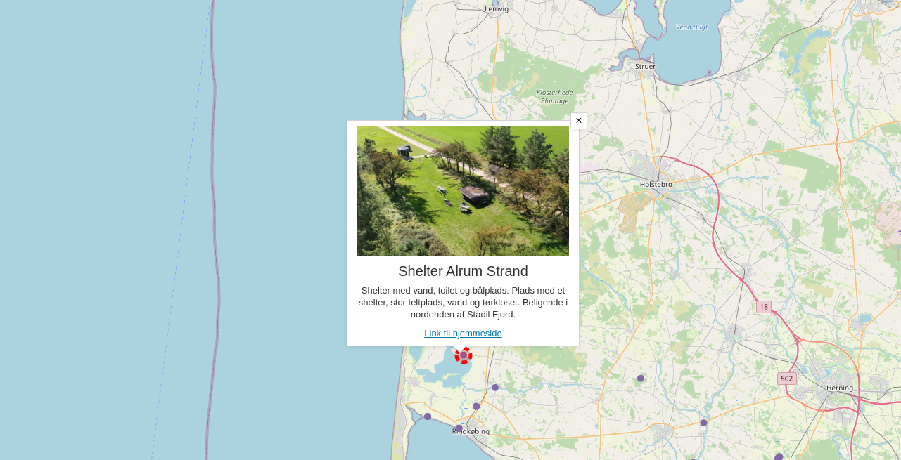

# Introduktion til pop-up systemet i Vidi

I Vidi bruges pop-ups i feature-info og mouse-over funktionerne. Indholdet i pop-ups styres af såkaldte *templates*. 
I de fleste tilfælde vil man typisk bruge den template, der er lagt ind som standard. Men man kan selv definere templates 
og derved give indholdet et andet layout og udtryk samt lave interaktive elementer i pop-ups.   

Denne workshop vil gå i dybden med hvordan templates skrives og anvendes.   

## Forudsætninger
For at kunne gennemføre denne workshop kræves adgang til GC2/Vidi.

Du kan anvende denne [GC2/Vidi installation](https://swarm.gc2.io/) hvor du kan oprette en database og uploade workshoppens [ene datasæt](https://github.com/gc2vidi/workshops/raw/main/Vidi-pop-ups/data/data.zip)

Dataene skal unzippes før upload til GC2.

Du kan oprette et schema kaldet `workshop` og uploade hertil.

Dataene består af:

* t_5800_fac_pkt.shp

Datasættet skal uploades med EPSG:25832 og med encoding UTF8.

