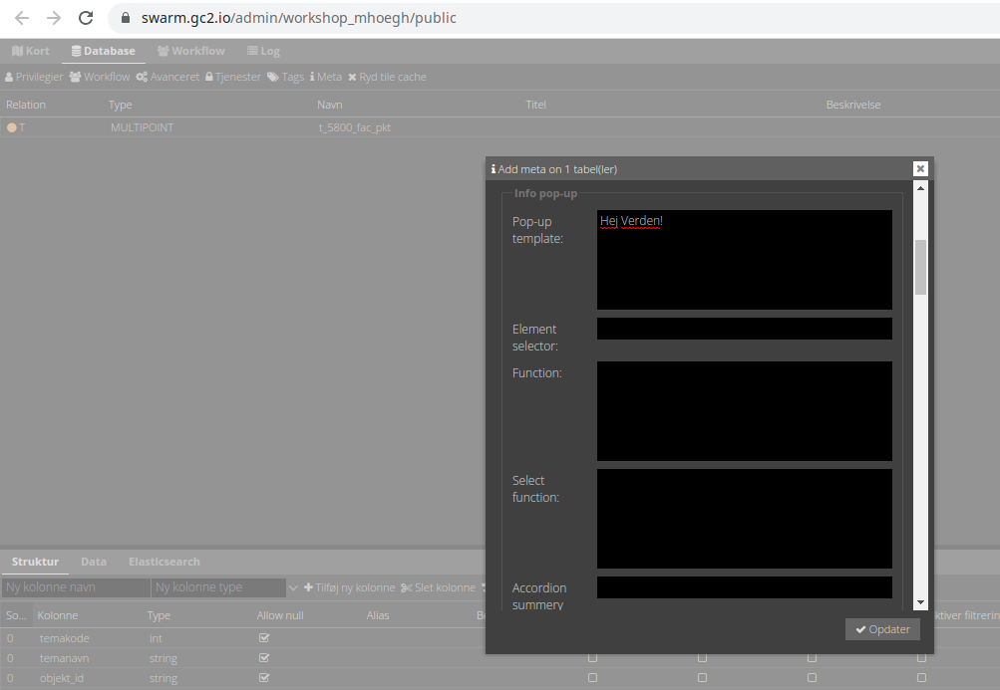

# Template basis

En template er tekst, som kan opmærkes med HTML. Så enhver HTML tekst er en valid template. Men det, som gør teksten til 
en template er muligheden for at placere såkaldte "pladsholdere" i teksten, der vil bliver skiftet ud med attribut-værdier 
fra den feature man klikker på.   

Der er også mulighed for at indbygge logiske udtryk og løkker i templates og dette vil blive introduceret i 05 Logik i templates   

## Hvordan skrives en template?

Vi starter ud med et meget simple template. Som skrevet ovenfor er en template blot tekst, som kan forsynes med HTML markører 
og pladsholdere, så ren tekst er faktisk også en valid template:

```text
Hej Verden!
```

En pop-up template skrives ind i `Meta > Pop-up template`:



Og med HTML markør for overskrift 1:

```html
<h1>Hej Verden!</h1>
```

HTML sproget er meget omfangsrigt og det er ikke denne workshops formål at dække andet end det mest basale. Der er mange 
kilder online, hvor man kan finde information om HTML. Organisationen Mozilla (dem med Firefox browseren) har en af de mest 
populærere [HTML: HyperText Markup Language](https://developer.mozilla.org/en-US/docs/Web/HTML). Hvis dette er første gang 
du skal arbejde med HTML, er det en god ide at kigge [HTML basics sektionen](https://developer.mozilla.org/en-US/docs/Learn/Getting_started_with_the_web/HTML_basics) igennem.

### HTML basis

HTML er et opmærkningssprog, der definerer strukturen af dit indhold. HTML består af en række elementer (tags), som du bruger til
at omslutte eller ombryde forskellige dele af indholdet for at få det til at fremstå på en bestemt måde eller handle på
en bestemt måde. De omsluttende tags kan lave et ord til et hyperlink, kan gøre ordet kursivt, kan gøre
skrifttypen større eller mindre, og så videre. Tag for eksempel følgende indholdslinje:

```text
My cat is very grumpy
```

Hvis vi ønskede, at linjen skulle stå for sig selv, kunne vi angive, at det er et afsnit ved at omslutte det i afsnitstags:

```html
<p>My cat is very grumpy</p>
```


## Pladsholdere

Det er nok ikke så interessant at skrive statisk tekst ind i pop-ups. Som regel vil man gerne vise indhold fra den feature 
man klikker på. Det er her pladsholdere kommer ind i billedet.   

En pladsholder er blot attribut-navnet (feltnavnet) opmærket med tegnende `{{ }}` fx:

```handlebars
Du klikkede på {{navn}}
```

Bemærk at `{{ }}` ikke er HTML opmærkning men tilhører template-sproget. Vidi vil simpelthen blot udskifte `{{navn}}` med 
værdien i attributten `navn` før browseren viser det. Her er templaten fået en HTML opmærkning, så navn bliver fremhævet:

```handlebars
Du klikkede på <b>{{navn}}</b>
```

## Øvelse

1. Start med at upload datasættet til GC2. Data skal uploades med encoding UTF8 og EPSG:25832. Placer laget i en gruppe, så det kan ses i Vidi.
2. Giv laget en styling. Man skal blot kunne se prikkerne. Man kan også slå laget om i vektorudgaven.
3. Åben `Meta` for laget og indsæt i `Pop-up template` en simpel template fra et af eksemplerne ovenfor. Eksperimenter med forskellige HTML tags. 
