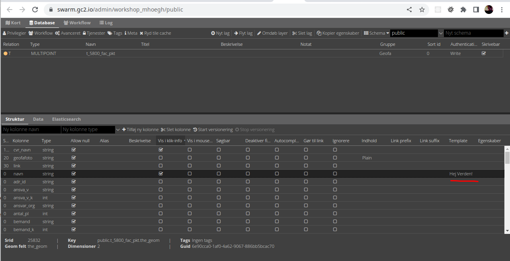

# Felt-templates

Hvis der ikke defineres en template anvendes standard templaten, som er en løkke, der løber alle attributter i gennem og
udskriver attribut-navn og værdi over hinanden. Standard templaten læser egenskaber fra lagets struktur-faneblad og tilpasser
indeholder derefter. Egenskaber omfatter om attributten skal være med, rækkefølge, alias, link, media mv.

Hvis en enkelte felter, skal se præsenteres anderledes end standard-templaten gør, behøver man ikke at skrive en hel ny template, 
men man kan i stedet definere en template til det enkelt felt.  

## Hej Verden! Eksempel

En felt-template fungere ligesom en pop-up-template, men skrives ind i Strukturfanen i kolonnen `Temaplate`. Man kan bruge alle tabellens 
felter i en felt-template:



```text
Hej Verden!
```

## Eksempler

Felt-templates kan anvendes til mange forskellige formål. Det kan være, at et felt i pop-up'en skal fremhæves vha. fx en anden 
farve eller man ønsker at sammentrække flere felter i et. Prøv fx denne template i feltet `navn`, der viser kommunenavnet i 
lys grå kursiv skrift bag selve navnet på faciliteten:


```html
{{navn}} <i style="color: silver">{{cvr_navn}}</i>
```


Det kan også være, at man ønsker, at der står noget andet end `link` når `Gør til link` anvendes. Samt kan der indsættes 
en titel på linket:


```html
<a href="{{link}}" target="_blank" title="Link til hjemmeside for {{navn}}">Link til ekstern hjemmeside</a>
```


## Øvelse

1. Indsæt en felt-template for et felt. Tag evt. udgangspunkt i ovenstående eksempler.
