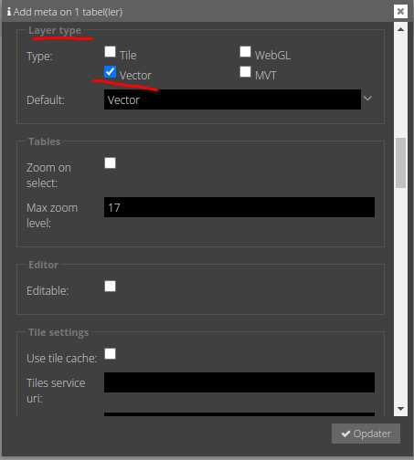
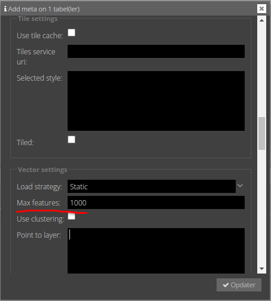
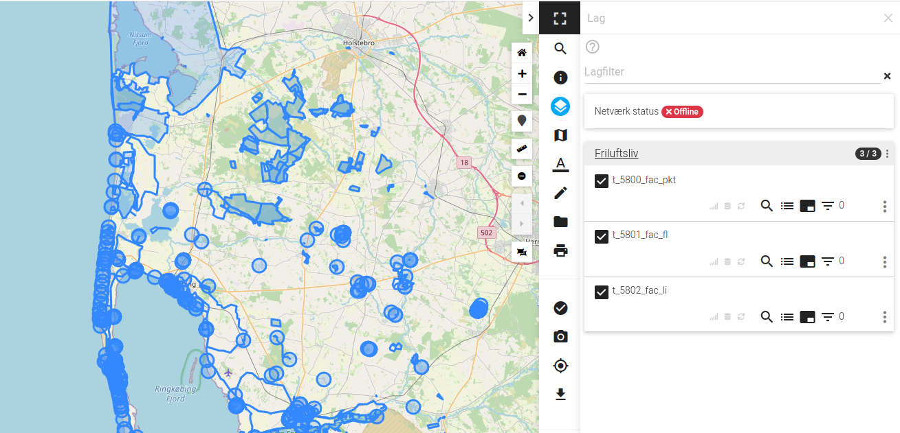

# Opsætning i GC2
Som standard er lag i GC2 opsat til kun at blive vist som rasterlag i Vidi. Som minimum skal man i Meta > Layer type > Type klikke Vector af.

[Dokumentation af Layer type](https://vidi.readthedocs.io/da/latest/pages/standard/92_gc2_meta_information.html#layer-type)

## Øvelse
Start med at upload de tre Shape Files. Alle datasæt skal uploades som EPSG:25832 med encoding UTF8. Ved upload af `t_5800_fac_pkt.shp` vælg `Point` i Type, da `Auto` vil resultere i Multi-Point.

Derefter placere lagene i en gruppe og klik `vector` af i Meta > Layer type.

[Video af upload og opsætning af vektorlag](https://vimeo.com/754279307)

For at undgå, at lag bliver for store og får browseren til at crashe, er der sat et loft på, hvor mange objekter et lag må indeholde. Det sættes individuelt for hvert enkelt lag og er standard sat til 100.
100 er sandsynligvis for lavt, men for linjer og polygoner kan geometrier kan være meget store (mange knækpunkter), så 100 sikrer, at man ikke starter med at crashe browseren.

`t_5800_fac_pkt.shp` indeholder over 357 punkter, så her der skrives et højere til ind i Meta > Vector settings > Max features

Start Vidi og tænd lagene. Det skulle gerne ligne dette:   

