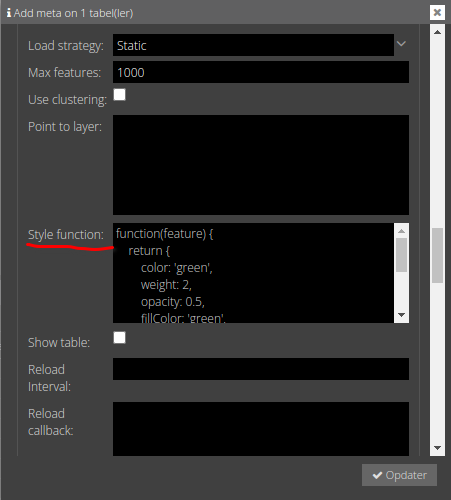

# Style funktionen
Et vektorlag dannes gennem en funtion. Man skal forestille sig, at hver feature (geometri og attributer) i laget bliver sendt til en funktion. Funktion returnere en style, som det enkelte objekt får.

Som udgangspunkt er der en style funktion, som giver vektorlag en blå farve som vi så lige før.

Style funktionen kan sættes i GC2 og når Vidi starter bliver funktionen hentet, så den kan bruges sammen med laget. Det er også muligt at sætte style funktionen i Vidi, så Vidi brugeren selv kan bestemme, hvordan et vektorlag skal styles - men mere om det senere.

En style funktion er opbygget således:

```javascript
function(feature) {
    return
}
```

"Ny" JavaScript syntax kan også anvendes:
```javascript
(feature) => {
    return
}
```

Lad os sige, at vi gerne vi gøre et lag grønt. Så kan man gøre det således:


```javascript
function(feature) {
    return {
        color: 'green',
        weight: 2,
        opacity: 0.5,
        fillColor: 'green',
        fillOpacity: 0.5,
        dashArray: '15 10',
        lineCap: 'butt',
        radius: 15
    }
}
```

Her er en [liste over alle egenskaber](https://leafletjs.com/reference.html#path) man kan sætte. Er det et punktlag med circleMarkers, kan `radius` også sættes.

Som det kan ses, kan farver angives som tekst (fx 'green'). [Se alle muligheder her](https://en.wikipedia.org/wiki/Web_colors). Farver kan også angives som hex værdier (fx '#ff0000' for rød).

## Øvelse
Indsæt ovenstående funktion i Meta > Vector settings > Style function



Ændre på værdier og se hvad, der sker. Husk at Vidi skal refreshes, når ændringer gennems i GC2.

[Video af ændring af Style funktionen ](https://vimeo.com/754616134)

Du kan også prøve det [direkte i Vidi](https://vidi.swarm.gc2.io/app/demo/workshop)


