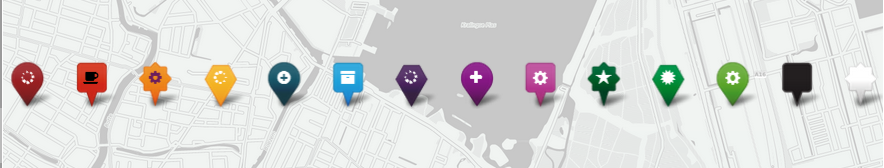
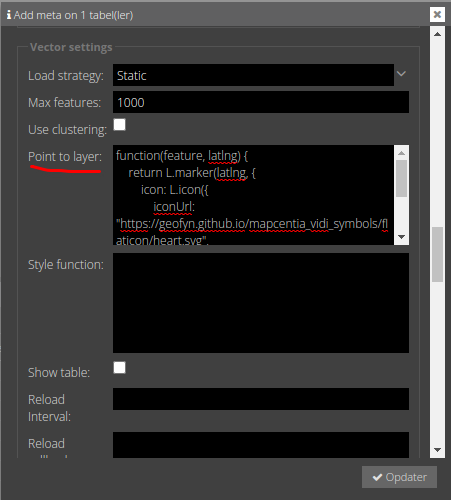

# Point-to-layer funktionen

Linjer og flader har begge en "streg" og sidstnævnte har også en udfyldning, som kan gives egenskaber såsom farve,
tykkelse, gennemsigtighed mv. Men punkter har hverken streg eller udfylding og skal derfor visualiseres gennem en "
markør".

Der er to former for markører:

1. CircleMarker
2. Icon

1) En circleMarker er et cirkelslag med punktet i centrum og en radius. En CircleMarker kan styles på samme måde som
   polygoner, som vi så i `04 Style funktionen`. Hvis der ikke sættes nogen Point-to-layer funktion bliver følgende
   anvendt.

```javascript
function (feature, latlng) {
    return L.circleMarker(latlng);
}
```

Man bør ikke indsætte ovenstående, men blot lade Point-to-layer stå tom, hvis man ønsker circleMarkers.

2) Icons er et stykke web grafik, som bliver sat ind hvor punktet er. Typisk anvendes det indbyggede "ExtraMarkers"
   bibliotek eller man henviser til egne SVG symboler. Men en markør kan også være et stykke brugerdefineret html.

## ExtraMarkers

Først en markør med ExtraMarkers. Dette er en hurtig måde at få vist nogle pæne markører på. Selve ikonet i markøren er
begrænset til det såkaldte Font Awesome bibliotek.

```javascript
function (feature, latlng) {
    return L.marker(latlng, {
        icon: L.ExtraMarkers.icon({
            icon: 'fa-fire',
            markerColor: 'blue',
            shape: 'circle',
            iconColor: '#fff',
            prefix: 'fas'
        })
    });
}
```

De egenskaber man kan ændre på er: `ìcon`, `markerColor`, `shape` og `iconColor`

For `icon` er det [Font Awesome v5](https://fontawesome.com/v5/search?o=r&m=free)

For `shape` er det 'circle', 'square', 'star', eller 'penta'

for `markerColor` er det 'red', 'orange-dark', 'orange', 'yellow', 'blue-dark', 'cyan', 'purple', 'violet', 'pink', '
green-dark', 'green', 'green-light', 'black', 'white'



## Eget image

Man kan også sætte et sit image ind som markør. Her er det et SVG image hosted på Github:

```javascript
function (feature, latlng) {
    return L.marker(latlng, {
        icon: L.icon({
            iconUrl: "https://geofyn.github.io/mapcentia_vidi_symbols/flaticon/heart.svg",
            iconSize: [24, 24],
            iconAnchor: [12, 12]
        })
    })
}
```

Her styrer `iconSize` størrelsen af ikonet og `iconAnchor`, hvor ikonet skal sættes i forhold til punktet.

## HTML marker

En markør kan også være et html element, som giver mulighed for billeder, links og andre elementer. Her bruges også en
attribut-værdi fra featuren:

```javascript
function (feature, latlng) {
    return L.marker(latlng, {
        icon: L.divIcon({
            html: feature.properties.navn,
            iconSize: [250, 50]
        })
    })
}
```

`html` kan være hvilken som helst html. Det er også muligt at sætte `className` så en brugerdefineret css regel kan
tilknyttes.

## CircleMarker

## Øvelse

Indsæt en Point-to-layer funktion i et punktlag. Prøv at ændre på nogle egenskaber.



Du kan også prøve det [direkte i Vidi](https://vidi.swarm.gc2.io/app/demo/workshop/)

