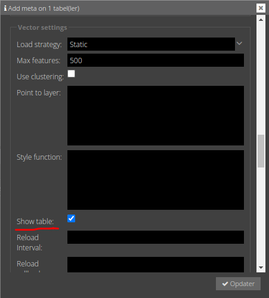
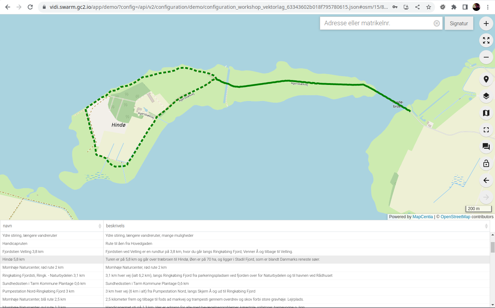

# Tabeller
Det er muligt at få lagets data vist i en tabel sammen med kortet.

Det gøres ved at klikke 'Show table' af i Meta > Vector settings:



BEMÆRK: Tabellen vises kun når Embed templaten benyttes. Derfor er det en god ide, at anvende en config, hvor også tabellens egenskaber skal sættes.

I denne config sættes embed.tmpl og der sættes egenskaber for tabellens placering dimensioner:

```json
{
    "schemata": [
        "workshop"
    ],
    "brandName": "Cykelkort",
    "enabledExtensions": [
        "embed"
    ],
    "template": "embed.tmpl",
    "vectorTable": {
        "position": "bottom",
        "width": "30%",
        "height": "250px"
    }
}
```

[Dokumentation af tabel egenskaber](https://vidi.readthedocs.io/da/latest/pages/standard/91_run_configuration.html#configjs-vectortable)

## Øvelse
1. Klik 'Show table' af i Meta > Vector settings for laget `t_5802_fac_li`.
2. Opret en ny config med ovenstående indhold (tilret evt. schemata) eller bruge [denne](https://vidi.swarm.gc2.io/app/demo/?config=/api/v2/configuration/demo/configuration_workshop_vektorlag_63343602b018f795780615.json) 
3. Tænd laget `t_5802_fac_li` og sæt filter `rute_ty_k = 3` (det er cykelruter)


