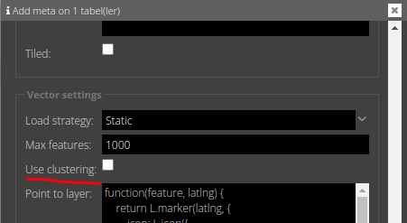
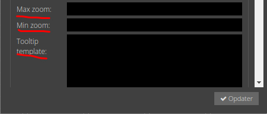

# Tooltip, Clustering, Min- og Max zoom level

Der er fire yderligere indstillinger man sætte på sit vektorlag:

1. Clustering
2. Tooltip
3. Min og max zoom level

   


## 1) Clustering

Når slået til bliver punkterne samlet i "clusters", hvis de er nærmere end 100 pixels på hinanden.
På den måde kan kortet indeholde et stort antal punkter, da alle ikke ses på samme tid. Det giver også et bedre overblik
over mange punkter. Cluster stilarten skal sættes
gennem css.

## 2) Tooltip

Hvis der angives en tooltip template får hver vektorfeature et tooltip/label med værdien. Templaten har adgang til alle
attributter i objektet.


```handlebars
{{navn}}
```


## 3) Min og max zoom level

Laveste/højeste zoom-level hvor laget skal være synligt. Værdien skal være en tile-set zoom level (0-20). Virker for
både vektor og marker lag.

## Øvelser

Prøv at sætte ovenstående egenskaber på lag.

